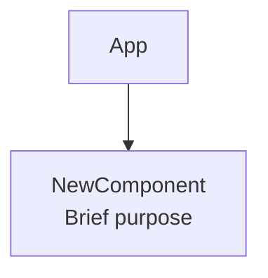

# Architecture Sync Rule

`architecture.md` in the project root is the **living system map** for this codebase. It must stay accurate. An outdated diagram actively misleads future contributors and LLMs reading the project.

> ⚠️ **After completing any implementation task, update `architecture.md` before considering the task done.**

---

## What to Update and Where

| What you implemented or changed | Section(s) to update in `architecture.md` |
|---|---|
| New React component | Component Hierarchy diagram · Renderer Process graph |
| New Zustand store | State Management Architecture diagram |
| New IPC handler or channel | IPC Channel Mapping table · IPC Handler Architecture diagram |
| New main-process service | Main Process graph · Process Architecture section |
| New preload API method | Preload Script section · Exposed APIs diagram |
| New MCP server (default) | Default MCP Servers list · MCP Server Configuration diagram |
| New agent service or sub-system | Agent Runtime Architecture diagram · relevant sub-section |
| New data flow (user-facing feature) | Data Flow section — add or update a sequence diagram |
| New tool or tool schema | MCP Integration section |
| Security configuration change | Security Architecture section |
| New hook | Hooks sub-graph in the Renderer Process section |

---

## How to Write a Good Update

### 1. Mermaid Diagrams — Add the Node/Edge
Find the relevant diagram and add (or rename/remove) the node. Do not leave a diagram showing the old state.



Keep labels short: `ComponentName<br/>One-line purpose`.

### 2. IPC Table — Add the Row
If you added a new IPC channel, add a row to the **IPC Channel Mapping** table:

```markdown
| `electron.domain.method()` | `domain:action` | `domain.ts` | What it does |
```

### 3. New Sub-System — Add a `####` Section
If you added a new service or agent module, add a `####` sub-heading in the relevant section. Follow the **file-level anchor format** from `documentation.md`:

```markdown
#### MyNewService
- **Role**: One-sentence purpose.
- **Owns**: Bullet list of responsibilities (≤ 6 words each).
- **Consumed by**: Which module calls this.
```

### 4. Sequence Diagrams — Update or Add for New Data Flows
If the feature introduces a new user-visible data flow, add a `sequenceDiagram` block in the **Data Flow** section.

---

## What NOT to Add

- Do not add long prose paragraphs restating code. The arch doc is a **map**, not a tutorial.
- Do not copy-paste code blocks into `architecture.md`. Use diagrams and short descriptions.
- Do not add a new section for trivial changes (e.g., renaming a prop, adding a setting field). Only structural changes that affect the component/service graph warrant an update.

---

## Verification Checklist

Before marking a task complete, confirm:

- [ ] Every new file that appears in `src/main/services/`, `src/renderer/src/components/`, `src/renderer/src/hooks/`, `src/renderer/src/lib/agent/`, or `src/renderer/src/stores/` has its node added to the relevant diagram.
- [ ] Every new IPC channel is in the IPC Channel Mapping table.
- [ ] Every new MCP default server is listed under Default MCP Servers.
- [ ] No diagram contains a node for a file/service that no longer exists.