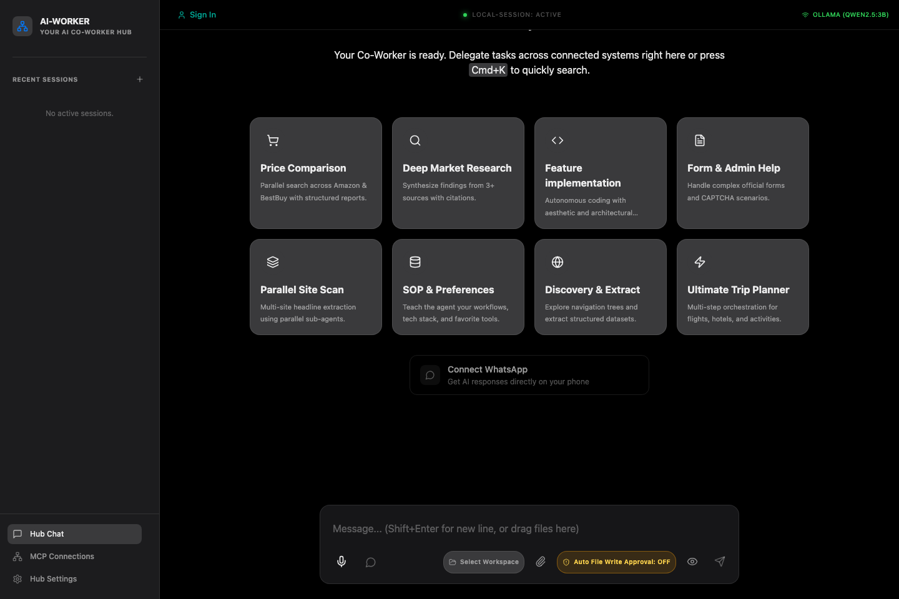

# AI-Worker 🎯

[](https://github.com/meharajM/ai-worker.app/actions/workflows/ci.yml)
[](https://opensource.org/licenses/MIT)
[](https://www.typescriptlang.org/)
[](https://nodejs.org/)
[](#)
[](CONTRIBUTING.md)

AI-Worker is a **voice-first desktop agent workspace** built on the **Model Context Protocol (MCP)**. It serves as an advanced sandbox environments for developers and power users to engineer workflows using on-device models or cloud APIs. By implementing modular structures across **Prompt Engineering**, **Context Engineering**, and **Harness/Tool Engineering**, AI-Worker bridges local desktop systems with powerful AI models securely and efficiently.



---

## 🛠️ The Core Engineering Paradigms

AI-Worker is designed around three fundamental engineering principles for modern agentic workflows:

```
┌─────────────────────────────────────────────────────────────────┐
│                           AI-Worker                             │
├───────────────────┬──────────────────────┬──────────────────────┤
│Prompt Engineering │ Context Engineering  │ Harness Engineering  │
│ ∙ System Alignment│ ∙ Semantic Memory    │ ∙ Browser Sandboxing │
│ ∙ On-Device LLMs  │ ∙ Context Pruning    │ ∙ Secure IPC Gateways│
│ ∙ Prompt Templates│ ∙ MCP Server Bindings│ ∙ Baileys/WA Bridge  │
└───────────────────┴──────────────────────┴──────────────────────┘
```

### 1. Prompt Engineering
- **System Instruction Alignment**: Enforces structured system prompt structures that align model behaviors to execution guidelines, ensuring tools are used only under strict validation constraints.
- **On-Device Inference**: Integrates `@mlc-ai/web-llm` to execute and tune prompt templates locally, utilizing WebGPU acceleration for zero-latency local agent execution.
- **Dynamic Variable Injection**: Compiles templates on-the-fly containing user directives, system states, and tool instructions.

### 2. Context Engineering
- **Semantic Memory Core**: Native integration with `@modelcontextprotocol/server-memory` to maintain a persistent semantic database, linking entities, preferences, and workspace structures.
- **Dynamic Context Window Pruning**: Implements algorithmic context reduction strategies to filter token bloat, ensuring key workspace metadata is preserved without overflowing the context limits of local models.
- **Multi-Source Context Binding**: Fuses data streams from local SQLite files, live browser environments, and active terminal sessions into a unified context payload.

### 3. Harness & Tool Engineering
- **Playwright Web Harness**: Bundles browser execution harnesses using `@playwright/mcp`, allowing models to run click-paths, query elements, take screenshots, and execute forms securely.
- **Secure Process Isolation**: Built with strict Electron security boundaries (sandbox, isolated context bridges, zero remote execution packages).
- **Communication Harnesses**: Integrated `baileys` socket hooks to create secure messaging loops directly linked to the user's phone, allowing the desktop agent to act as a chat companion.

---

## ✨ Features

- 🎤 **Voice-First Command Center** - Input instructions via localized speech recognition (Vosk-browser) for absolute privacy.
- 🔌 **Model Context Protocol (MCP) Integration** - Out of the box stdio/SSE client connections to custom or community MCP servers.
- 🌐 **Web-LLM Integration** - On-device AI execution bypassing cloud latency, cost, and data leakage risks.
- 💬 **WhatsApp Agent Gateway** - Interface with WhatsApp via headless messaging layers.
- 📂 **Workspace Synchronization** - Real-time file system watchers that index local project structures.
- 🔒 **Enterprise-Grade Security** - Context isolation, node integration disabling, and validated IPC boundaries. See [SECURITY.md](SECURITY.md).

---

## 🚀 Quick Start

### Prerequisites

- **Node.js** ≥ 22.12.0 - [NodeJS Official Site](https://nodejs.org/)
- **npm** (comes with Node) or **yarn** / **pnpm**
- **Python 3** (Optional, for Python-based MCP servers)

### Installation

1. **Clone the repository**
   ```bash
   git clone https://github.com/meharajM/ai-worker.app.git
   cd ai-worker.app
   ```

2. **Install project dependencies**
   ```bash
   npm install
   ```

3. **Bootstrap MCP and Local Dependencies**
   - For macOS and Linux:
     ```bash
     chmod +x ./scripts/setup-dependencies.sh
     ./scripts/setup-dependencies.sh
     ```
   - For Windows (run PowerShell as Administrator):
     ```powershell
     .\scripts\setup-dependencies.ps1
     ```

4. **Launch Developer Workspace**
   ```bash
   npm run dev
   ```

5. **Build Native Binary Installers**
   ```bash
   # macOS
   npm run build:mac
   
   # Linux
   npm run build:linux
   
   # Windows
   npm run build:win
   ```

---

## 📖 Documentation & Guides

To assist with onboarding and architectural review, explore our detailed documentation:

### User Documentation
- [Setup & Installation](docs/INSTALLATION.md) — Detailed environment bootstrapping.
- [User Guide & Operations](docs/USER_GUIDE.md) — Voice controls, model configurations, and messenger setups.
- [MCP Integration Guide](docs/MCP_GUIDE.md) — How to configure and connect custom MCP servers.

### Developer Documentation
- [System Architecture](docs/architecture/phase-3-migration-plan.md) — Structural diagrams, security reviews, and component definitions.
- [Developer & Testing Guide](docs/DEVELOPMENT.md) — Linting protocols, security guidelines, and test suite execution command index.
- [Security Policy & Rules](SECURITY.md) — Secure IPC specifications, Chromium sandboxing boundaries, and vulnerability report routing.

---

## 🏗️ Commands Directory

```bash
# Start development workspace (HMR)
npm run dev

# Clear dev server cache and reboot app clean
npm run dev:clean

# Validate formatting rules
npm run lint

# Auto-fix linting issues
npm run lint:fix

# Run typescript compilation verification
npm run typecheck

# Execute E2E automated test pipeline
npm run test:e2e

# Execute speech model tests
npm run test:speech
```

---

## 📦 Project Directory Layout

```
ai-worker.app/
├── src/
│   ├── main/          # Electron backend, native system drivers, SQLite, process runners
│   ├── preload/       # Security context bridges (exposes secure IPC hooks only)
│   ├── renderer/      # React frontend application UI and local Web-LLM controllers
│   └── agents/        # Intent analysis, prompt compilers, context pruners, loop managers
├── docs/              # Guides, proposals, setup manuals, screenshots
├── tests/             # Playwright test scripts, E2E validation flows, mock engines
├── scripts/           # Platform dependent configuration bootstrapping
└── build/             # Package installer assets (icons, splash screens)
```

---

## 🤝 Contributing

We love contributions! Please read our [CONTRIBUTING.md](CONTRIBUTING.md) and [CODE_OF_CONDUCT.md](CODE_OF_CONDUCT.md) files to learn about our community standards, development processes, and how to submit pull requests.

---

## 📄 License

AI-Worker is open-source software licensed under the [MIT License](LICENSE).
