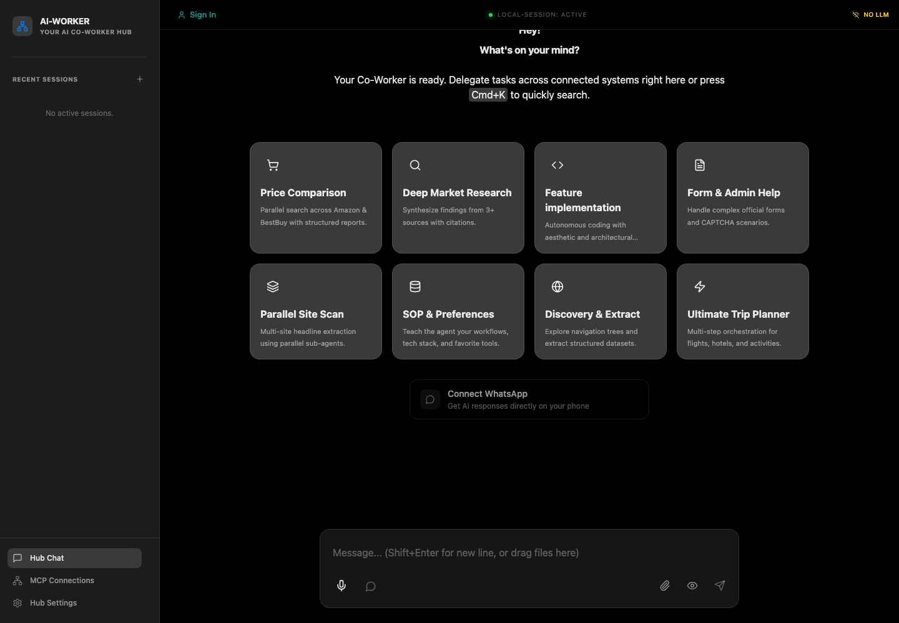
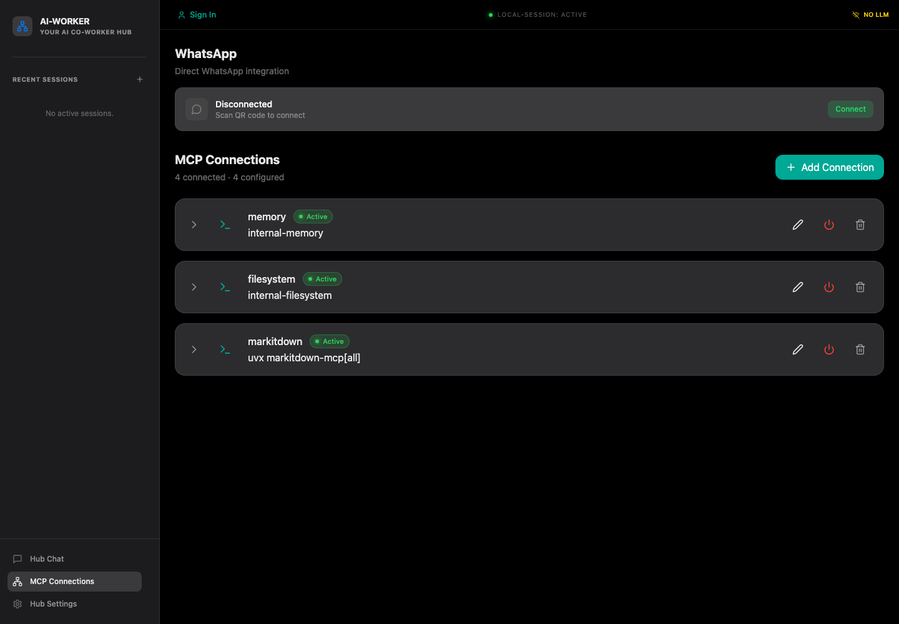
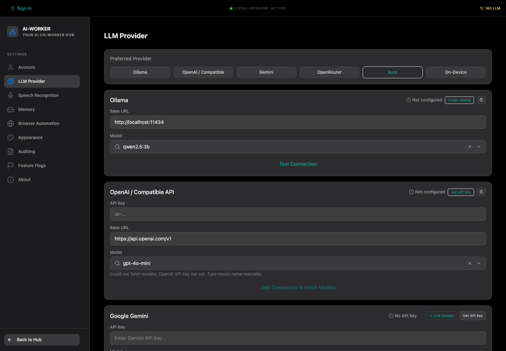
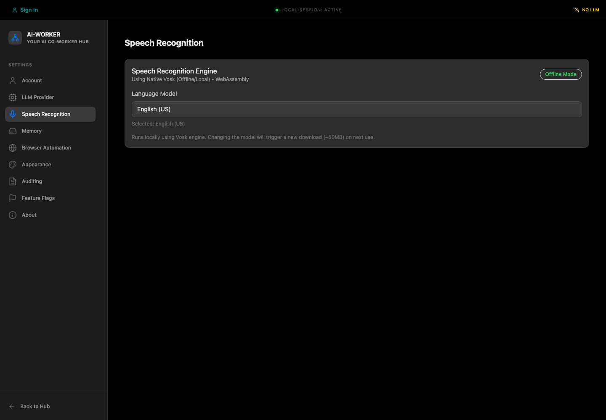

# AI-Worker

[](https://github.com/meharajM/ai-worker.app/actions/workflows/ci.yml)
[](./LICENSE)
[](./CONTRIBUTING.md)

AI-Worker is an open-source, voice-first desktop AI workspace for people who want one local hub for chat, files, browser automation, MCP tools, and provider-agnostic LLM workflows.



## Why It Exists

Most AI tools stop at chat. AI-Worker is built around the next step: connecting the assistant to useful local capabilities while keeping the workspace understandable, inspectable, and desktop-native.

Use it to coordinate research, document extraction, local file work, browser tasks, WhatsApp-assisted approvals, and MCP-powered automations from one app.

## Features

- Voice-first chat workspace with text input, file drag-and-drop, and workflow starter tiles.
- MCP connections for memory, filesystem access, MarkItDown document conversion, and browser automation.
- Provider choices for Ollama, OpenAI-compatible APIs, Gemini, OpenRouter, auto mode, and on-device paths where available.
- Offline/local Vosk speech recognition configuration.
- Playwright-backed browser automation for navigation, extraction, forms, and screenshots.
- Direct WhatsApp integration for phone-based messaging and approval workflows.
- Electron desktop packaging for macOS, Linux, and Windows.

## Screenshots







## Quick Start

Requirements:

- Node.js `>=22.12.0`
- npm
- Python 3 and `uv` for Python-backed MCP tools such as MarkItDown

Install and run:

```bash
npm install
npm run dev
```

Run local quality checks:

```bash
npm run lint
npm run typecheck
npm run build
npm run test:mock
```

For detailed setup instructions, see [docs/setup.md](./docs/setup.md).

## Usage

Start in `Hub Chat`, configure a model provider in `Hub Settings`, then use `MCP Connections` to inspect or add connected tools. The default local setup includes internal memory, filesystem, MarkItDown, and Playwright-backed browser automation services.

For a walkthrough of chat, speech, providers, MCP, WhatsApp, browser automation, and common workflows, see [docs/usage.md](./docs/usage.md).

## Documentation

- [Setup Guide](./docs/setup.md)
- [Usage Guide](./docs/usage.md)
- [Docs Index](./docs/README.md)
- [Scripts README](./scripts/README.md)

## Project Status

AI-Worker is early-stage open source software. The core Electron app, renderer UI, MCP connection surface, provider settings, speech settings, and release scripts are present, but the project is still being hardened for public contributors and first-time installers.

Known current development note: if the Electron shell fails during local development, the renderer may still be available at `http://localhost:5173`. The setup guide documents this fallback.

Before broad public promotion, dependency audit findings should be triaged and GitHub repository settings should be reviewed.

## Contributing

Contributions are welcome. Start with [CONTRIBUTING.md](./CONTRIBUTING.md), open an issue for larger changes, and include validation notes in every pull request.

Useful entrypoints:

- [Bug report](https://github.com/meharajM/ai-worker.app/issues/new?template=bug_report.md)
- [Feature request](https://github.com/meharajM/ai-worker.app/issues/new?template=feature_request.md)
- [Security policy](./SECURITY.md)
- [Code of conduct](./CODE_OF_CONDUCT.md)

## Release And Publishing

The release process is optimized to run locally on macOS to avoid high-cost GitHub Actions runners and stay within GitHub Free Tier limits.

To publish releases to Cloudflare R2, create a `.env.r2` file in the project root:

```bash
cp .env.r2.example .env.r2
# Fill in your R2 credentials from the Cloudflare Dashboard
```

Publish commands:

```bash
npm run publish:all
npm run publish:mac
npm run publish:mac:universal
npm run publish:linux
npm run publish:win
npm run publish:linux-win
```

All publish scripts ask for a `yes` confirmation before proceeding to production.

## CI

GitHub Actions runs lint, typecheck, prebuild checks, build, and mocked E2E checks on pull requests and pushes to `main` or `prod`.

## License

AI-Worker is released under the [MIT License](./LICENSE).
