# AI-Worker: System Architecture

This document provides a comprehensive overview of the AI-Worker application architecture, including system design, component relationships, data flow, and integration patterns.

---

## Table of Contents

1. [System Overview](#system-overview)
2. [Process Architecture](#process-architecture)
3. [Component Architecture](#component-architecture)
4. [Data Flow](#data-flow)
5. [IPC Communication](#ipc-communication)
6. [MCP Integration](#mcp-integration)
7. [LLM Integration](#llm-integration)
8. [Storage Architecture](#storage-architecture)
9. [Security Architecture](#security-architecture)
10. [Build & Distribution](#build--distribution)

---

## System Overview

AI-Worker is built on Electron, following a multi-process architecture with strict security boundaries. The application consists of three main processes: Main Process, Preload Script, and Renderer Process.

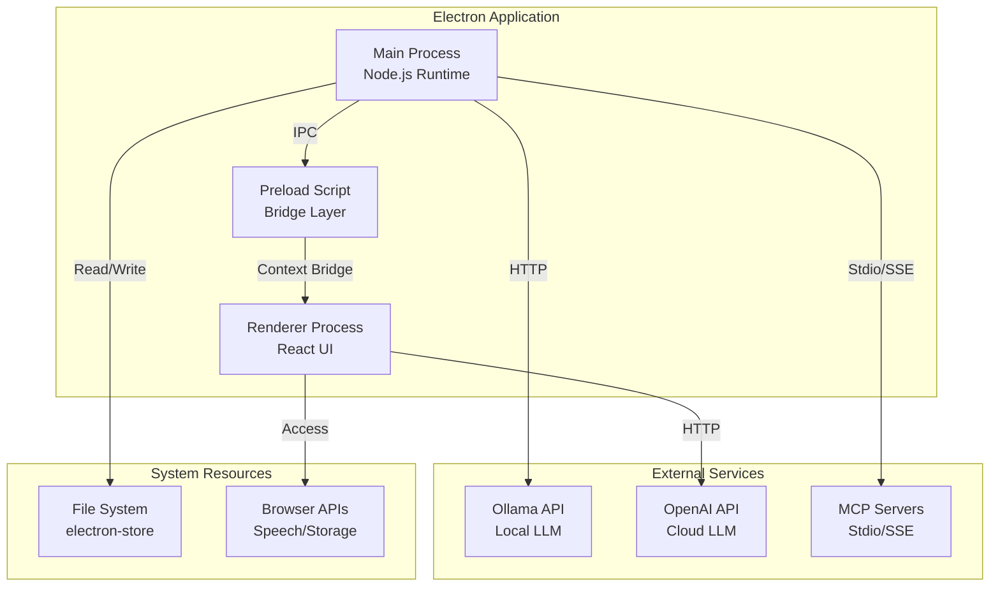
```mermaid
graph TB
    subgraph "Electron Application"
        Main[Main Process<br/>Node.js Runtime]
        Preload[Preload Script<br/>Bridge Layer]
        Renderer[Renderer Process<br/>React UI]
    end

    subgraph "External Services"
        Ollama[Ollama API<br/>Local LLM]
        OpenAI[OpenAI API<br/>Cloud LLM]
        MCPServers[MCP Servers<br/>Stdio/SSE]
    end

    subgraph "System Resources"
        FileSystem[File System<br/>electron-store]
        BrowserAPIs[Browser APIs<br/>Speech/Storage]
    end

    Main -->|IPC| Preload
    Preload -->|Context Bridge| Renderer
    Main -->|HTTP| Ollama
    Renderer -->|HTTP| OpenAI
    Main -->|Stdio/SSE| MCPServers
    Main -->|Read/Write| FileSystem
    Renderer -->|Access| BrowserAPIs
```

---

## Process Architecture

### Main Process

The Main Process runs in Node.js and handles system-level operations, MCP connections, and IPC communication.

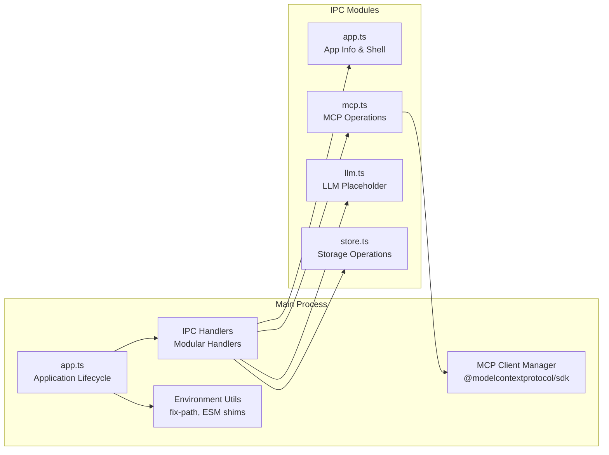
```mermaid
graph LR
    subgraph "Main Process"
        App[app.ts<br/>Application Lifecycle]
        IPC[IPC Handlers<br/>Modular Handlers]
        MCP[MCP Client Manager<br/>@modelcontextprotocol/sdk]
        Env[Environment Utils<br/>fix-path, ESM shims]
    end

    subgraph "IPC Modules"
        AppHandlers[app.ts<br/>App Info & Shell]
        MCPHandlers[mcp.ts<br/>MCP Operations]
        LLMHandlers[llm.ts<br/>LLM Placeholder]
        StoreHandlers[store.ts<br/>Storage Operations]
    end

    App --> IPC
    IPC --> AppHandlers
    IPC --> MCPHandlers
    IPC --> LLMHandlers
    IPC --> StoreHandlers
    MCPHandlers --> MCP
    App --> Env
```

**Key Responsibilities:**

- Window management and lifecycle
- IPC handler registration
- MCP server connections (Stdio/SSE)
- System-level operations (file system, shell)
- Environment setup (PATH fixing, ESM compatibility)

### Preload Script

The Preload Script runs in an isolated context and bridges the Main and Renderer processes securely.

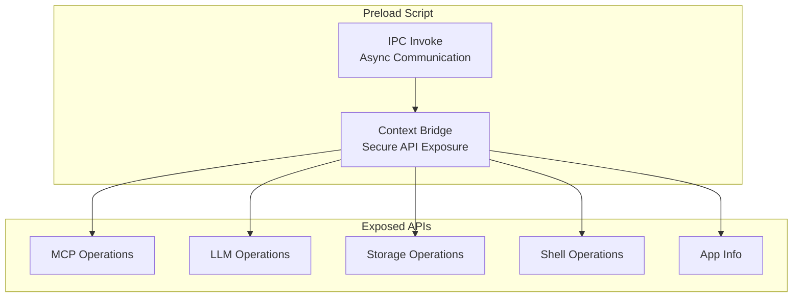
```mermaid
graph TB
    subgraph "Preload Script"
        ContextBridge[Context Bridge<br/>Secure API Exposure]
        IPCInvoke[IPC Invoke<br/>Async Communication]
    end

    subgraph "Exposed APIs"
        MCPAPI[MCP Operations]
        LLMAPI[LLM Operations]
        StoreAPI[Storage Operations]
        ShellAPI[Shell Operations]
        AppAPI[App Info]
    end

    ContextBridge --> MCPAPI
    ContextBridge --> LLMAPI
    ContextBridge --> StoreAPI
    ContextBridge --> ShellAPI
    ContextBridge --> AppAPI
    IPCInvoke --> ContextBridge
```

**Key Responsibilities:**

- Expose secure APIs to renderer via `contextBridge`
- Translate renderer calls to IPC invocations
- Maintain security boundaries (no direct Node.js access)

### Renderer Process

The Renderer Process runs React in a Chromium-based environment, handling all UI and user interactions.

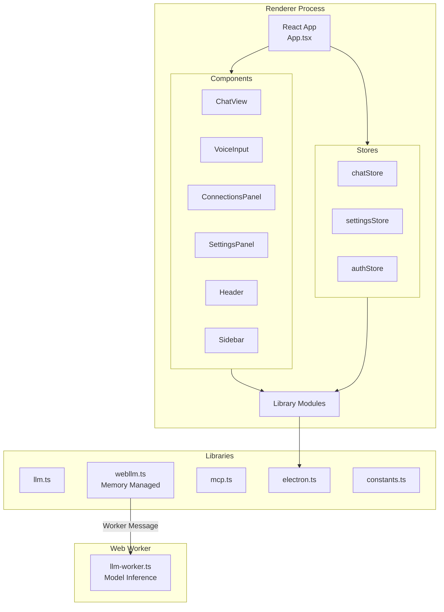
```mermaid
graph TB
    subgraph "Renderer Process"
        ReactApp[React App<br/>App.tsx]
        Components[UI Components]
        Stores[Zustand Stores]
        Lib[Library Modules]
    end

    subgraph "Components"
        ChatView[ChatView]
        VoiceInput[VoiceInput]
        ConnectionsPanel[ConnectionsPanel]
        SettingsPanel[SettingsPanel]
        Header[Header]
        Sidebar[Sidebar]
    end

    subgraph "Stores"
        ChatStore[chatStore]
        SettingsStore[settingsStore]
        AuthStore[authStore]
    end

    subgraph "Libraries"
        LLMLib[llm.ts]
        WebLLMLib[webllm.ts<br/>Memory Managed]
        MCPLib[mcp.ts]
        ElectronLib[electron.ts]
        Constants[constants.ts]
    end

    ReactApp --> Components
    ReactApp --> Stores
    Components --> Lib
    Stores --> Lib
    Lib --> ElectronLib
    
    subgraph "Web Worker"
        LLMWorker[llm-worker.ts<br/>Model Inference]
    end
    
    WebLLMLib -->|Worker Message| LLMWorker
```

**Key Responsibilities:**

- UI rendering and user interactions
- State management (Zustand)
- LLM API calls (via fetch)
- Voice input/output (Web Speech API)
- Local storage (localStorage)

---

## Component Architecture

### UI Component Hierarchy

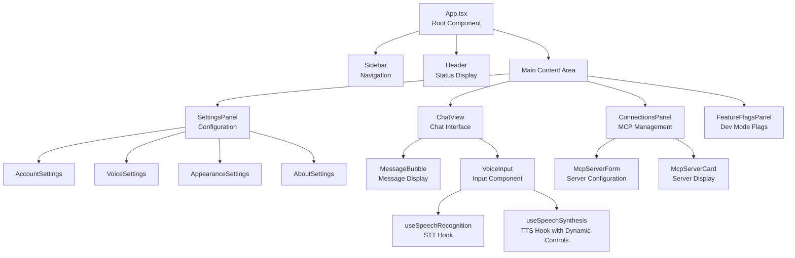
```mermaid
graph TD
    App[App.tsx<br/>Root Component]

    App --> Sidebar[Sidebar<br/>Navigation]
    App --> Header[Header<br/>Status Display]
    App --> Main[Main Content Area]

    Main --> ChatView[ChatView<br/>Chat Interface]
    Main --> ConnectionsPanel[ConnectionsPanel<br/>MCP Management]
    Main --> SettingsPanel[SettingsPanel<br/>Configuration]
    
    SettingsPanel --> AccountSettings[AccountSettings]
    SettingsPanel --> VoiceSettings[VoiceSettings]
    SettingsPanel --> AppearanceSettings[AppearanceSettings]
    SettingsPanel --> AboutSettings[AboutSettings]
    Main --> FeatureFlagsPanel[FeatureFlagsPanel<br/>Dev Mode Flags]
    
    ChatView --> MessageBubble[MessageBubble<br/>Message Display]
    ChatView --> VoiceInput[VoiceInput<br/>Input Component]

    ConnectionsPanel --> McpServerForm[McpServerForm<br/>Server Configuration]
    ConnectionsPanel --> McpServerCard[McpServerCard<br/>Server Display]

    VoiceInput --> SpeechRecognition[useSpeechRecognition<br/>STT Hook]
    VoiceInput --> SpeechSynthesis[useSpeechSynthesis<br/>TTS Hook with Dynamic Controls]
```

### State Management Architecture

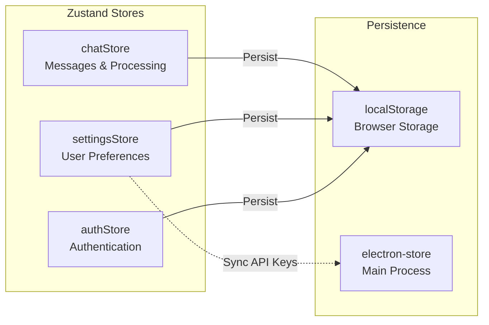
```mermaid
graph LR
    subgraph "Zustand Stores"
        ChatStore[chatStore<br/>Messages & Processing]
        SettingsStore[settingsStore<br/>User Preferences]
        AuthStore[authStore<br/>Authentication]
    end

    subgraph "Persistence"
        LocalStorage[localStorage<br/>Browser Storage]
        ElectronStore[electron-store<br/>Main Process]
    end

    ChatStore -->|Persist| LocalStorage
    SettingsStore -->|Persist| LocalStorage
    AuthStore -->|Persist| LocalStorage

    SettingsStore -.->|Sync API Keys| ElectronStore
```

---

## Data Flow

### User Message Flow

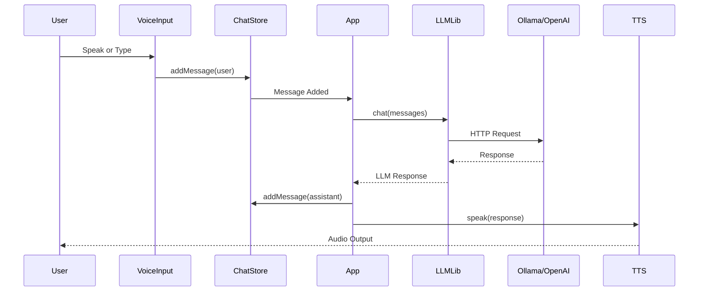
```mermaid
sequenceDiagram
    participant User
    participant VoiceInput
    participant ChatStore
    participant App
    participant LLMLib
    participant Ollama/OpenAI
    participant TTS

    User->>VoiceInput: Speak or Type
    VoiceInput->>ChatStore: addMessage(user)
    ChatStore->>App: Message Added
    App->>LLMLib: chat(messages)
    LLMLib->>Ollama/OpenAI: HTTP Request
    Ollama/OpenAI-->>LLMLib: Response
    LLMLib-->>App: LLM Response
    App->>ChatStore: addMessage(assistant)
    App->>TTS: speak(response)
    TTS-->>User: Audio Output
```

### MCP Connection Flow

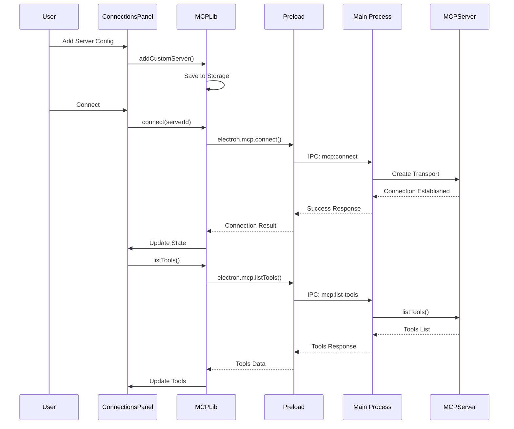
```mermaid
sequenceDiagram
    participant User
    participant ConnectionsPanel
    participant MCPLib
    participant Preload
    participant Main Process
    participant MCPServer

    User->>ConnectionsPanel: Add Server Config
    ConnectionsPanel->>MCPLib: addCustomServer()
    MCPLib->>MCPLib: Save to Storage
    User->>ConnectionsPanel: Connect
    ConnectionsPanel->>MCPLib: connect(serverId)
    MCPLib->>Preload: electron.mcp.connect()
    Preload->>Main Process: IPC: mcp:connect
    Main Process->>MCPServer: Create Transport
    MCPServer-->>Main Process: Connection Established
    Main Process-->>Preload: Success Response
    Preload-->>MCPLib: Connection Result
    MCPLib->>ConnectionsPanel: Update State
    ConnectionsPanel->>MCPLib: listTools()
    MCPLib->>Preload: electron.mcp.listTools()
    Preload->>Main Process: IPC: mcp:list-tools
    Main Process->>MCPServer: listTools()
    MCPServer-->>Main Process: Tools List
    Main Process-->>Preload: Tools Response
    Preload-->>MCPLib: Tools Data
    MCPLib->>ConnectionsPanel: Update Tools
```

### Settings Persistence Flow

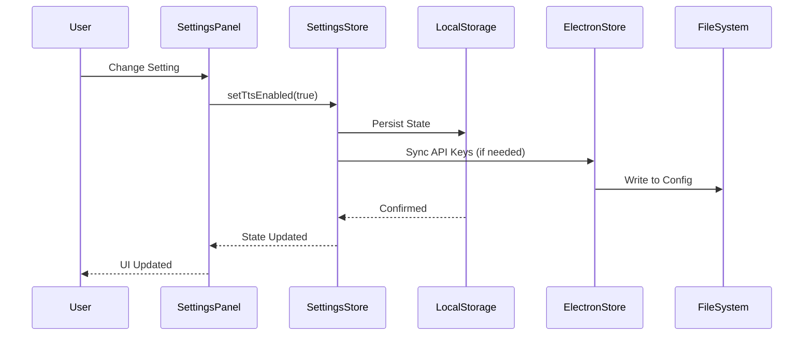
```mermaid
sequenceDiagram
    participant User
    participant SettingsPanel
    participant SettingsStore
    participant LocalStorage
    participant ElectronStore

    User->>SettingsPanel: Change Setting
    SettingsPanel->>SettingsStore: setTtsEnabled(true)
    SettingsStore->>LocalStorage: Persist State
    SettingsStore->>ElectronStore: Sync API Keys (if needed)
    ElectronStore->>FileSystem: Write to Config
    LocalStorage-->>SettingsStore: Confirmed
    SettingsStore-->>SettingsPanel: State Updated
    SettingsPanel-->>User: UI Updated
```

---

## IPC Communication

### IPC Handler Architecture

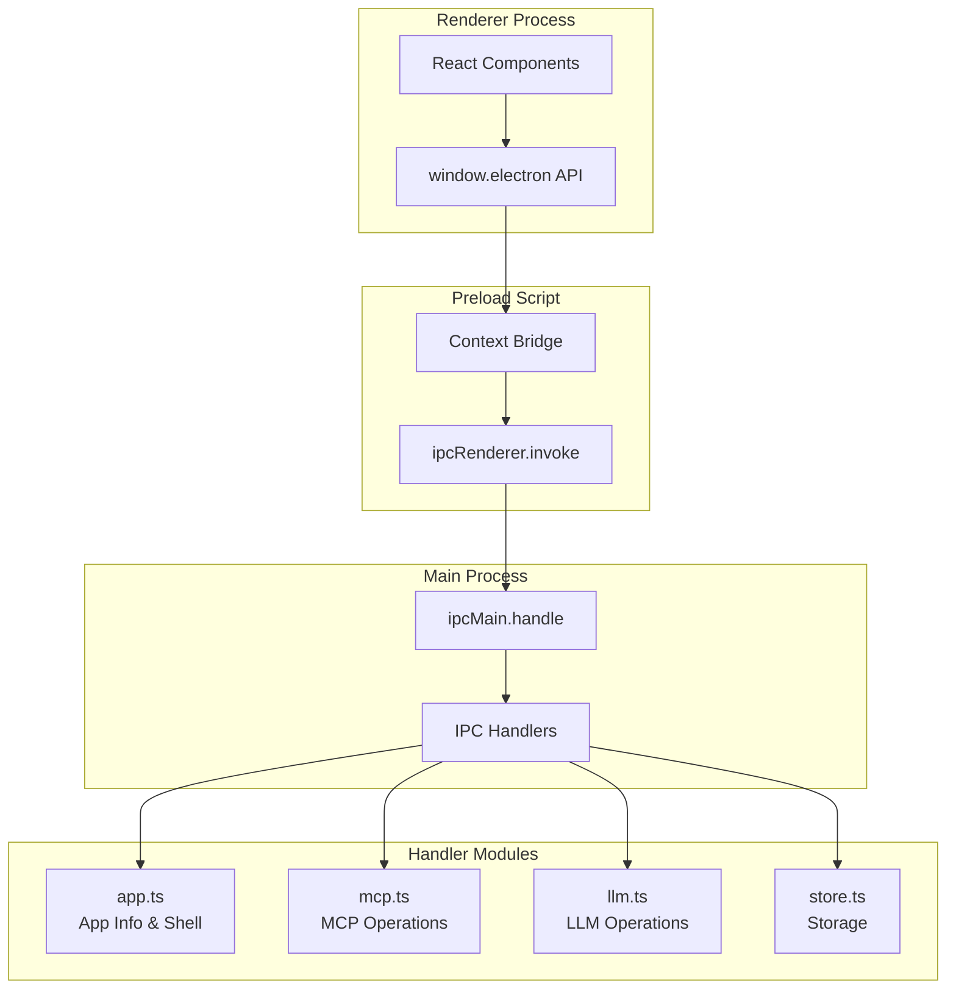
```mermaid
graph TB
    subgraph "Renderer Process"
        Renderer[React Components]
        ElectronAPI[window.electron API]
    end

    subgraph "Preload Script"
        ContextBridge[Context Bridge]
        IPCInvoke[ipcRenderer.invoke]
    end

    subgraph "Main Process"
        IPCReceive[ipcMain.handle]
        Handlers[IPC Handlers]
    end

    subgraph "Handler Modules"
        AppH[app.ts<br/>App Info & Shell]
        MCPH[mcp.ts<br/>MCP Operations]
        LLMH[llm.ts<br/>LLM Operations]
        StoreH[store.ts<br/>Storage]
    end

    Renderer --> ElectronAPI
    ElectronAPI --> ContextBridge
    ContextBridge --> IPCInvoke
    IPCInvoke --> IPCReceive
    IPCReceive --> Handlers
    Handlers --> AppH
    Handlers --> MCPH
    Handlers --> LLMH
    Handlers --> StoreH
```

### IPC Channel Mapping

| Renderer API                    | IPC Channel           | Handler Module | Description            |
| ------------------------------- | --------------------- | -------------- | ---------------------- |
| `electron.mcp.connect()`        | `mcp:connect`         | `mcp.ts`       | Connect to MCP server  |
| `electron.mcp.disconnect()`     | `mcp:disconnect`      | `mcp.ts`       | Disconnect from server |
| `electron.mcp.listTools()`      | `mcp:list-tools`      | `mcp.ts`       | List available tools   |
| `electron.mcp.callTool()`       | `mcp:call-tool`       | `mcp.ts`       | Execute MCP tool       |
| `electron.store.get()`          | `store:get`           | `store.ts`     | Get stored value       |
| `electron.store.set()`          | `store:set`           | `store.ts`     | Set stored value       |
| `electron.shell.openExternal()` | `shell:open-external` | `app.ts`       | Open external URL      |
| `electron.app.getVersion()`     | `app:get-version`     | `app.ts`       | Get app version        |

---

## MCP Integration

### Default MCP Servers

AI-Worker comes with two pre-configured MCP servers that are automatically initialized on first run:

1. **Playwright Server** (`playwright`)

   - Purpose: Browser automation and web interaction
   - Configuration:
     - Type: `stdio`
     - Command: `npx`
     - Args: `-y @modelcontextprotocol/server-playwright`
   - Tools: Browser navigation, screenshot, DOM interaction

2. **Sequential Thinking Server** (`sequential-thinking`)
   - Purpose: Step-by-step reasoning for complex tasks
   - Configuration:
     - Type: `stdio`
     - Command: `npx`
     - Args: `-y @modelcontextprotocol/server-sequential-thinking`
   - Tools: Sequential reasoning, task decomposition

**Initialization Behavior:**

- Default servers are created automatically when localStorage is empty (first run)
- Missing default servers are automatically added on app load
- Users can edit, remove, or customize default servers
- Form pre-fills with Sequential Thinking configuration for quick setup

### MCP Client Architecture

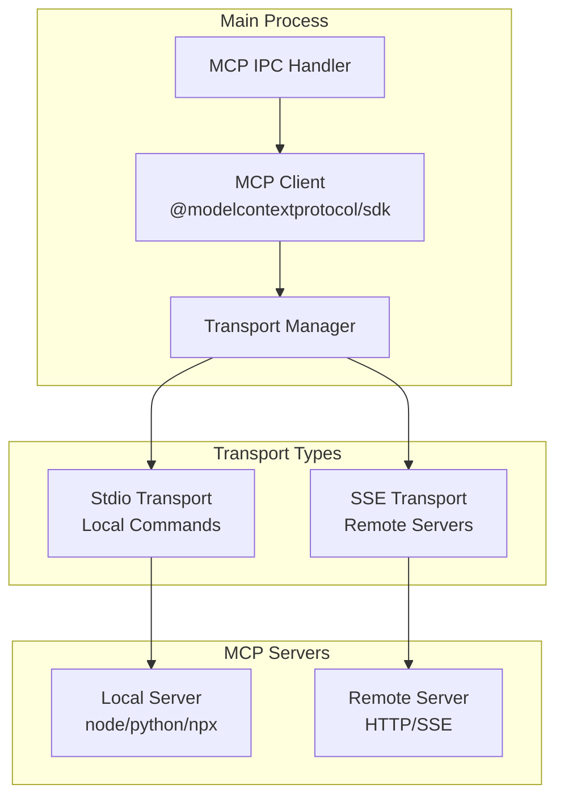
```mermaid
graph TB
    subgraph "Main Process"
        MCPHandler[MCP IPC Handler]
        MCPClient[MCP Client<br/>@modelcontextprotocol/sdk]
        TransportManager[Transport Manager]
    end

    subgraph "Transport Types"
        StdioTransport[Stdio Transport<br/>Local Commands]
        SSETransport[SSE Transport<br/>Remote Servers]
    end

    subgraph "MCP Servers"
        LocalServer[Local Server<br/>node/python/npx]
        RemoteServer[Remote Server<br/>HTTP/SSE]
    end

    MCPHandler --> MCPClient
    MCPClient --> TransportManager
    TransportManager --> StdioTransport
    TransportManager --> SSETransport
    StdioTransport --> LocalServer
    SSETransport --> RemoteServer
```

### MCP Connection Lifecycle

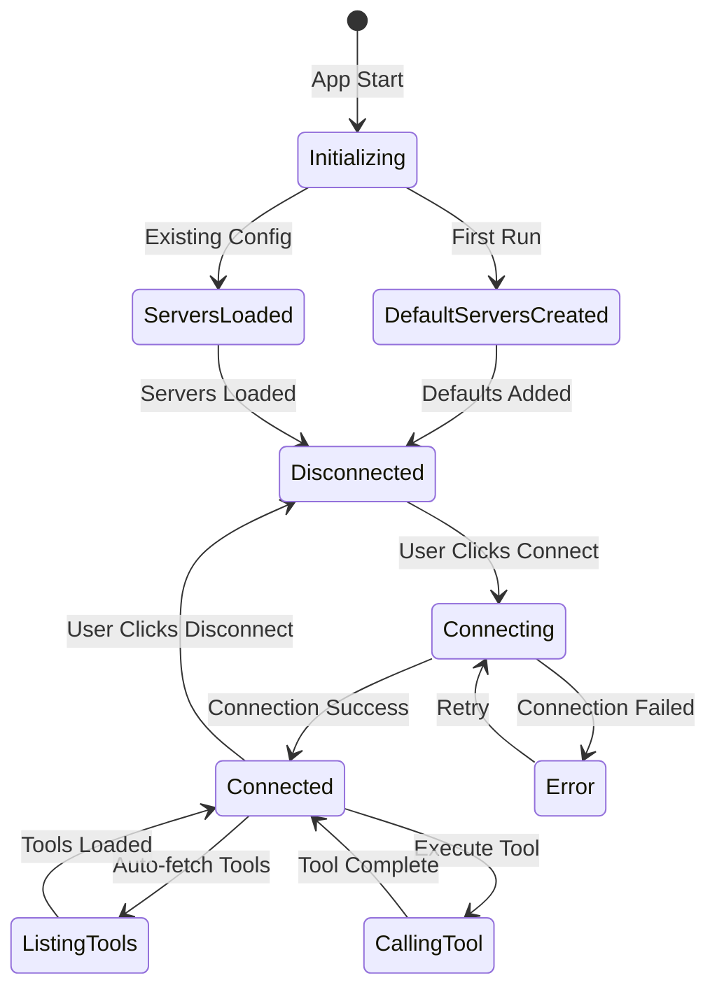
```mermaid
stateDiagram-v2
    [*] --> Initializing: App Start
    Initializing --> DefaultServersCreated: First Run
    Initializing --> ServersLoaded: Existing Config
    DefaultServersCreated --> Disconnected: Defaults Added
    ServersLoaded --> Disconnected: Servers Loaded
    Disconnected --> Connecting: User Clicks Connect
    Connecting --> Connected: Connection Success
    Connecting --> Error: Connection Failed
    Error --> Connecting: Retry
    Connected --> Disconnected: User Clicks Disconnect
    Connected --> ListingTools: Auto-fetch Tools
    ListingTools --> Connected: Tools Loaded
    Connected --> CallingTool: Execute Tool
    CallingTool --> Connected: Tool Complete
```

**Initialization Flow:**

1. App loads → Check localStorage for existing servers
2. If empty → Create default servers (Playwright, Sequential Thinking)
3. If servers exist → Load them and ensure defaults are present
4. Missing defaults → Automatically add them

### MCP Server Configuration

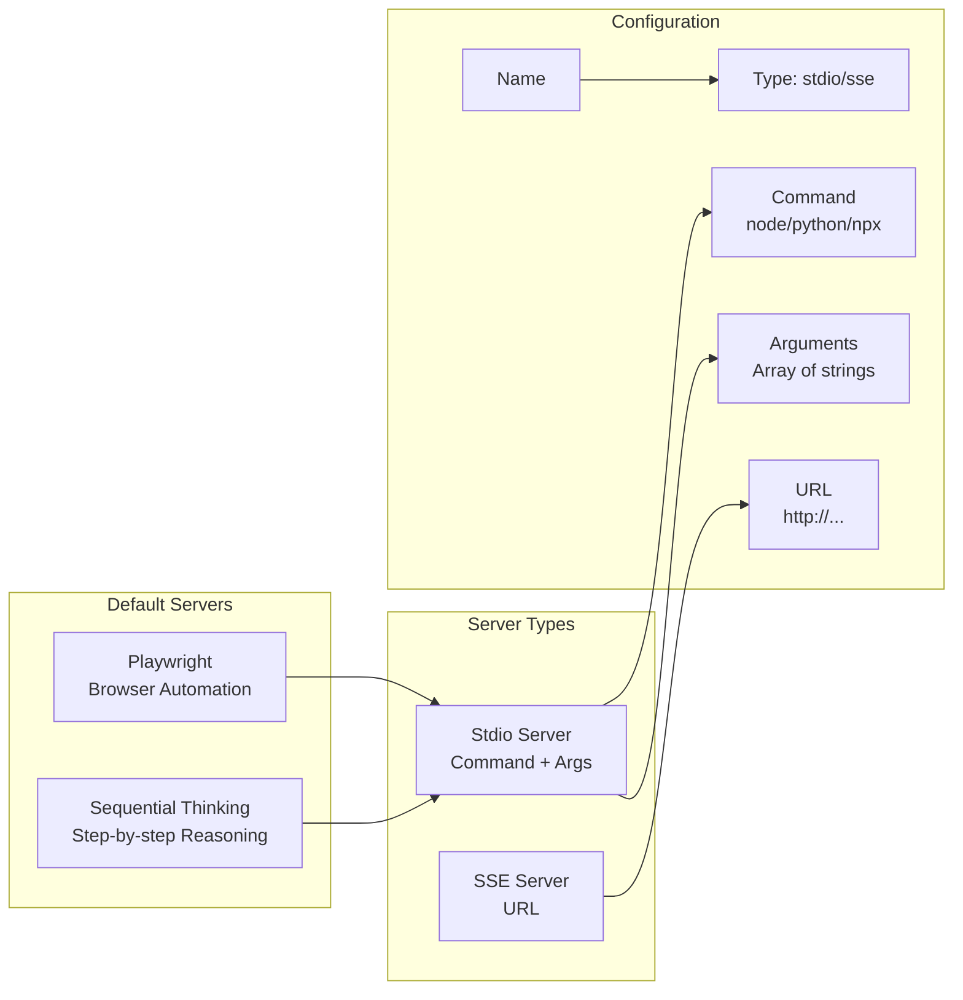
```mermaid
graph LR
    subgraph "Server Types"
        Stdio[Stdio Server<br/>Command + Args]
        SSE[SSE Server<br/>URL]
    end

    subgraph "Configuration"
        Name[Name]
        Type[Type: stdio/sse]
        Command[Command<br/>node/python/npx]
        Args[Arguments<br/>Array of strings]
        URL[URL<br/>http://...]
    end

    subgraph "Default Servers"
        Playwright[Playwright<br/>Browser Automation]
        SequentialThinking[Sequential Thinking<br/>Step-by-step Reasoning]
    end

    Stdio --> Command
    Stdio --> Args
    SSE --> URL
    Name --> Type
    Playwright --> Stdio
    SequentialThinking --> Stdio
```

**Default MCP Servers:**

- **Playwright** (`playwright`)

  - Type: `stdio`
  - Command: `npx`
  - Args: `-y @modelcontextprotocol/server-playwright`
  - Description: Browser automation and web interaction tools

- **Sequential Thinking** (`sequential-thinking`)
  - Type: `stdio`
  - Command: `npx`
  - Args: `-y @modelcontextprotocol/server-sequential-thinking`
  - Description: Enables step-by-step reasoning for complex tasks

**Initialization Logic:**

- Default servers are automatically created on first run (when localStorage is empty)
- Missing default servers are automatically added on app load
- Users can edit, remove, or customize default servers
- Form pre-fills with Sequential Thinking configuration for quick setup

---

## LLM Integration

### LLM Provider Architecture

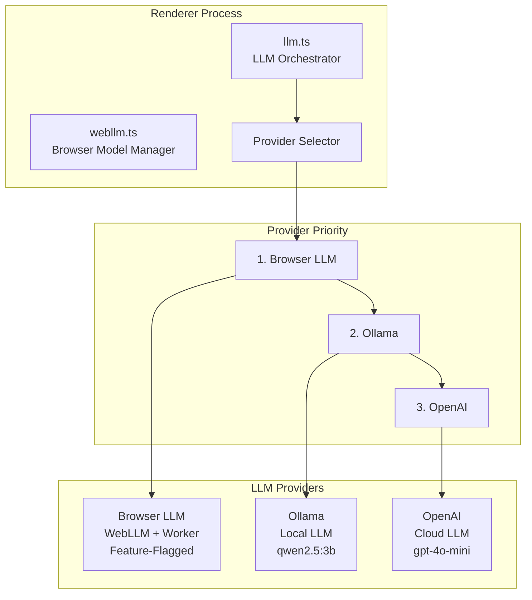
```mermaid
graph TB
    subgraph "Renderer Process"
        LLMLib[llm.ts<br/>LLM Orchestrator]
        WebLLM[webllm.ts<br/>Browser Model Manager]
        ProviderSelector[Provider Selector]
    end

    subgraph "LLM Providers"
        BrowserLLM[Browser LLM<br/>WebLLM + Worker<br/>Feature-Flagged]
        Ollama[Ollama<br/>Local LLM<br/>qwen2.5:3b]
        OpenAI[OpenAI<br/>Cloud LLM<br/>gpt-4o-mini]
    end

    subgraph "Provider Priority"
        Priority1[1. Browser LLM]
        Priority2[2. Ollama]
        Priority3[3. OpenAI]
    end

    LLMLib --> ProviderSelector
    ProviderSelector --> Priority1
    Priority1 --> BrowserLLM
    Priority1 --> Priority2
    Priority2 --> Ollama
    Priority2 --> Priority3
    Priority3 --> OpenAI
```

### LLM Request Flow

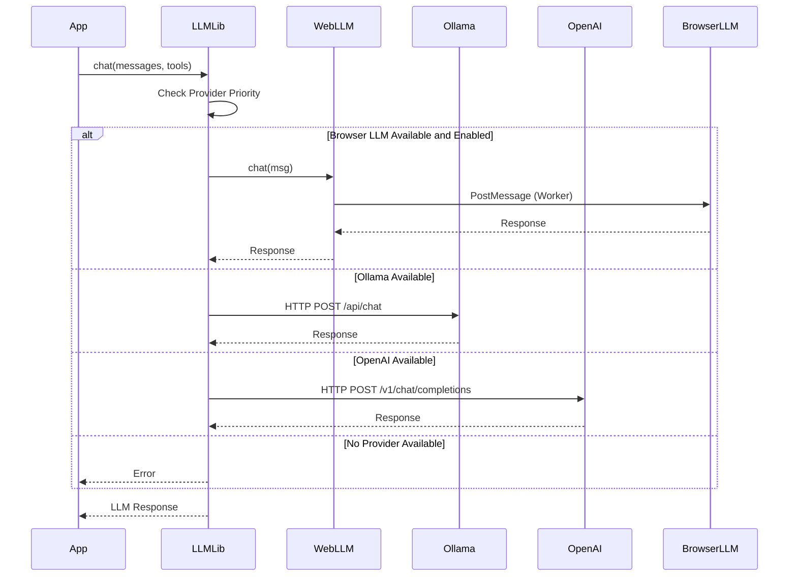
```mermaid
sequenceDiagram
    participant App
    participant LLMLib
    participant WebLLM
    participant Ollama
    participant OpenAI
    participant BrowserLLM

    App->>LLMLib: chat(messages, tools)
    LLMLib->>LLMLib: Check Provider Priority
    
    
    alt Browser LLM Available and Enabled
        LLMLib->>WebLLM: chat(msg)
        WebLLM->>BrowserLLM: PostMessage (Worker)
        BrowserLLM-->>WebLLM: Response
        WebLLM-->>LLMLib: Response
    else Ollama Available
        LLMLib->>Ollama: HTTP POST /api/chat
        Ollama-->>LLMLib: Response
    else OpenAI Available
        LLMLib->>OpenAI: HTTP POST /v1/chat/completions
        OpenAI-->>LLMLib: Response
    else No Provider Available
        LLMLib-->>App: Error
    end

    LLMLib-->>App: LLM Response
```

### LLM Configuration

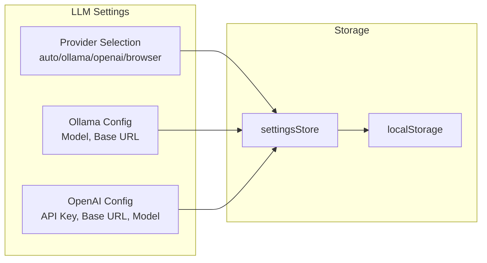
```mermaid
graph LR
    subgraph "LLM Settings"
        Provider[Provider Selection<br/>auto/ollama/openai/browser]
        OllamaConfig[Ollama Config<br/>Model, Base URL]
        OpenAIConfig[OpenAI Config<br/>API Key, Base URL, Model]
    end

    subgraph "Storage"
        SettingsStore[settingsStore]
        LocalStorage[localStorage]
    end

    Provider --> SettingsStore
    OllamaConfig --> SettingsStore
    OpenAIConfig --> SettingsStore
    SettingsStore --> LocalStorage
```

---

## Storage Architecture

### Storage Layers

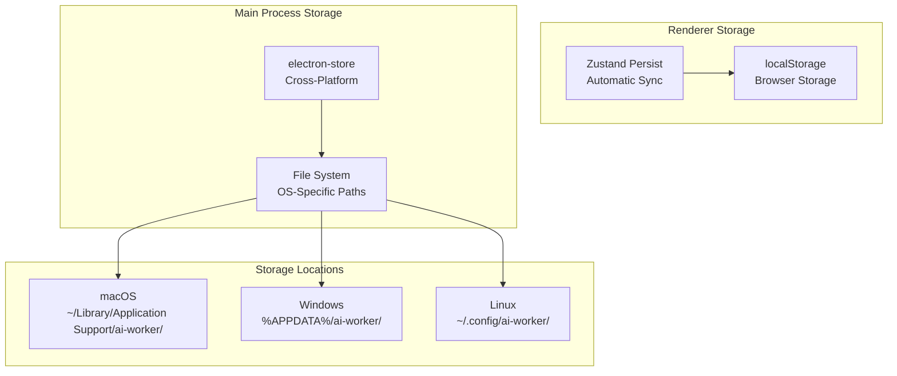
```mermaid
graph TB
    subgraph "Renderer Storage"
        LocalStorage[localStorage<br/>Browser Storage]
        ZustandPersist[Zustand Persist<br/>Automatic Sync]
    end

    subgraph "Main Process Storage"
        ElectronStore[electron-store<br/>Cross-Platform]
        FileSystem[File System<br/>OS-Specific Paths]
    end

    subgraph "Storage Locations"
        MacPath[macOS<br/>~/Library/Application Support/ai-worker/]
        WinPath[Windows<br/>%APPDATA%/ai-worker/]
        LinuxPath[Linux<br/>~/.config/ai-worker/]
    end

    ZustandPersist --> LocalStorage
    ElectronStore --> FileSystem
    FileSystem --> MacPath
    FileSystem --> WinPath
    FileSystem --> LinuxPath
```

### Data Persistence Strategy

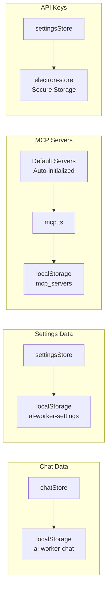
```mermaid
graph LR
    subgraph "Chat Data"
        ChatStore[chatStore]
        ChatLocalStorage[localStorage<br/>ai-worker-chat]
    end

    subgraph "Settings Data"
        SettingsStore[settingsStore]
        SettingsLocalStorage[localStorage<br/>ai-worker-settings]
    end

    subgraph "MCP Servers"
        MCPLib[mcp.ts]
        MCPStorage[localStorage<br/>mcp_servers]
        DefaultServers[Default Servers<br/>Auto-initialized]
    end

    DefaultServers --> MCPLib

    subgraph "API Keys"
        SettingsStore2[settingsStore]
        ElectronStore2[electron-store<br/>Secure Storage]
    end

    ChatStore --> ChatLocalStorage
    SettingsStore --> SettingsLocalStorage
    MCPLib --> MCPStorage
    SettingsStore2 --> ElectronStore2
```

---

## Security Architecture

### Security Boundaries

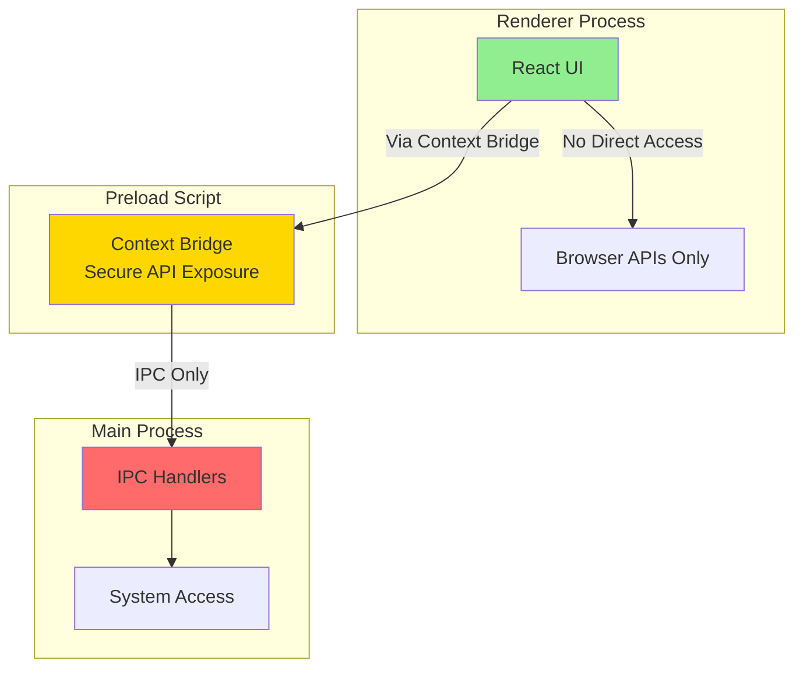
```mermaid
graph TB
    subgraph "Renderer Process<br/>Sandboxed"
        ReactUI[React UI]
        BrowserAPIs[Browser APIs Only]
    end

    subgraph "Preload Script<br/>Isolated Context"
        ContextBridge[Context Bridge<br/>Secure API Exposure]
    end

    subgraph "Main Process<br/>Full Node.js Access"
        IPC[IPC Handlers]
        SystemAccess[System Access]
    end

    ReactUI -->|No Direct Access| BrowserAPIs
    ReactUI -->|Via Context Bridge| ContextBridge
    ContextBridge -->|IPC Only| IPC
    IPC --> SystemAccess

    style ReactUI fill:#90EE90
    style ContextBridge fill:#FFD700
    style IPC fill:#FF6B6B
```

### Content Security Policy

```mermaid
graph LR
    subgraph "CSP Rules"
        Localhost[Allow localhost:*<br/>Ollama, Local Services]
        HTTPS[Allow https://*<br/>OpenAI, External APIs]
        WSS[Allow wss://*<br/>WebSocket, Speech API]
        Media[Allow media-src<br/>Audio for TTS]
    end

    subgraph "Blocked"
        InlineScripts[Block Inline Scripts]
        Eval[Block eval()]
        UnsafeInline[Block unsafe-inline]
    end

    Localhost --> Security
    HTTPS --> Security
    WSS --> Security
    Media --> Security
    InlineScripts --> Security
    Eval --> Security
    UnsafeInline --> Security
```

---

## Quality Assurance

### Testing Infrastructure

AI-Worker utilizes **Vitest** for robust unit testing, integrated into the development workflow and CI pipeline.

```mermaid
graph LR
    subgraph "Test Suite"
        Unit[Unit Tests<br/>Vitest]
        E2E[E2E Mock<br/>Playwright]
        Type[Type Check<br/>TSC]
    end

    subgraph "Coverage"
        Stores[Zustand Stores]
        Utils[Utilities]
        Constants[Constants]
    end

    Unit --> Stores
    Unit --> Utils
    Unit --> Constants
    
    subgraph "Mocks"
        ElectronMock[Electron IPC]
        BrowserMock[Browser APIs]
    end

    Unit -.-> ElectronMock
    Unit -.-> BrowserMock
```

**Testing Levels:**
1. **Unit Tests (`npm run test:unit`)**: Validates individual stores, hooks, and utility logic in isolation.
2. **Integration Tests (`npm run test:mock`)**: Verifies the full application flow with mocked LLM and MCP services.
3. **Type Checking (`npm run typecheck`)**: Ensures strict TypeScript compliance.

---

## Build & Distribution

### Build Architecture

```mermaid
graph TB
    subgraph "Source Code"
        TypeScript[TypeScript Source]
        React[React Components]
        Assets[Static Assets]
    end

    subgraph "Build Process"
        ElectronVite[electron-vite<br/>Build Tool]
        Vite[Vite<br/>Frontend Bundler]
        TSC[TypeScript Compiler]
    end

    subgraph "Output"
        MainOut[out/main/<br/>Main Process]
        PreloadOut[out/preload/<br/>Preload Script]
        RendererOut[out/renderer/<br/>Renderer Bundle]
    end

    subgraph "Packaging"
        ElectronBuilder[electron-builder]
        MacBuild[macOS<br/>DMG + ZIP]
        WinBuild[Windows<br/>NSIS + Portable]
        LinuxBuild[Linux<br/>AppImage + deb]
    end

    TypeScript --> ElectronVite
    React --> ElectronVite
    Assets --> ElectronVite
    ElectronVite --> Vite
    ElectronVite --> TSC
    Vite --> RendererOut
    TSC --> MainOut
    TSC --> PreloadOut
    MainOut --> ElectronBuilder
    PreloadOut --> ElectronBuilder
    RendererOut --> ElectronBuilder
    ElectronBuilder --> MacBuild
    ElectronBuilder --> WinBuild
    ElectronBuilder --> LinuxBuild
    
### Cross-Platform Build Support

AI-Worker supports building for Windows from a Linux environment using Wine. This is integrated into the build process to ensure seamless CI/CD and local development compatibility.

**Windows Build Flow on Linux:**

1. **Dependency Check:** `npm run check:wine` verifies if Wine is installed.
2. **Environment Setup:** 
   - `install_build_deps.sh`: Helper to install Wine if missing.
   - `fix_wine_env.sh`: Troubleshooting tool to reset corrupted Wine prefixes.
3. **Build Execution:** `electron-builder` uses Wine to sign and package the Windows executable (`.exe`).

```bash
# Workflow
./install_build_deps.sh  # One-time setup
npm run build:win        # Builds .exe using Wine
```
```

### Distribution Structure

```mermaid
graph LR
    subgraph "macOS"
        DMG[AI-Worker.dmg<br/>~97 MB]
        ZIP[AI-Worker.zip<br/>~92 MB]
    end

    subgraph "Windows"
        NSIS[AI-Worker Setup.exe<br/>~79 MB]
        Portable[AI-Worker.exe<br/>~79 MB]
    end

    subgraph "Linux"
        AppImage[AI-Worker.AppImage<br/>~105 MB]
        DEB[ai-worker.deb<br/>~68 MB]
    end

    DMG --> Distribution
    ZIP --> Distribution
    NSIS --> Distribution
    Portable --> Distribution
    AppImage --> Distribution
    DEB --> Distribution
```

---

## Technology Stack

### Core Technologies

| Layer           | Technology                | Version | Purpose                       |
| --------------- | ------------------------- | ------- | ----------------------------- |
| **Framework**   | Electron                  | 28.2.0  | Desktop application framework |
| **Frontend**    | React                     | 18.2.0  | UI library                    |
| **Language**    | TypeScript                | 5.3.3   | Type-safe development         |
| **Styling**     | Tailwind CSS              | 3.4.1   | Utility-first CSS             |
| **State**       | Zustand                   | 5.0.9   | State management              |
| **Build**       | electron-vite             | 2.0.0   | Build tooling                 |
| **MCP**         | @modelcontextprotocol/sdk | 1.0.1   | MCP client library            |
| **Storage**     | electron-store            | 11.0.2  | Cross-platform storage        |
| **Environment** | fix-path                  | 5.0.0   | PATH resolution               |

### Development Tools

| Tool             | Purpose               |
| ---------------- | --------------------- |
| Vite             | Fast frontend bundler |
| TypeScript       | Type checking         |
| electron-builder | Application packaging |
| PostCSS          | CSS processing        |
| Autoprefixer     | CSS vendor prefixes   |

---

## File Structure

```
ai-worker-app/
├── src/
│   ├── main/                    # Main Process
│   │   ├── index.ts            # App entry point
│   │   ├── ipc/                 # IPC handlers
│   │   │   ├── index.ts        # Handler registration
│   │   │   ├── app.ts          # App info & shell
│   │   │   ├── mcp.ts          # MCP operations
│   │   │   ├── llm.ts          # LLM operations
│   │   │   └── store.ts        # Storage operations
│   │   └── utils/
│   │       └── env.ts          # Environment setup
│   ├── preload/                 # Preload Script
│   │   └── index.ts            # Context bridge
│   └── renderer/                # Renderer Process
│       └── src/
│           ├── App.tsx          # Root component
│           ├── components/      # UI components
│           ├── hooks/           # React hooks
│           ├── lib/             # Library modules
│           └── stores/         # Zustand stores
├── out/                         # Build output
├── dist/                        # Distribution packages
└── package.json                 # Dependencies
```

---

## Key Design Decisions

### 1. Multi-Process Architecture

- **Decision:** Use Electron's multi-process model
- **Rationale:** Security isolation, better performance, system access control

### 2. Context Isolation

- **Decision:** Enable context isolation with preload script
- **Rationale:** Security best practice, prevents renderer from accessing Node.js directly

### 3. Modular IPC Handlers

- **Decision:** Split IPC handlers into separate modules
- **Rationale:** Better maintainability, easier testing, clear separation of concerns

### 4. Zustand for State Management

- **Decision:** Use Zustand instead of Redux
- **Rationale:** Simpler API, less boilerplate, built-in persistence

### 5. Renderer-Side LLM Calls

- **Decision:** Make LLM API calls from renderer process
- **Rationale:** Simpler implementation, direct fetch API access, future main-process option available

### 6. Local-First Storage

- **Decision:** Use localStorage and electron-store
- **Rationale:** Privacy-focused, no cloud dependency, fast access

### 7. MCP in Main Process

- **Decision:** Handle MCP connections in main process
- **Rationale:** System-level access needed, better security, proper process management

---

## Future Architecture Considerations

### Planned Enhancements

1. **Main Process LLM Handling**

   - Move LLM calls to main process for better security
   - Implement streaming responses
   - Add request queuing

2. **Browser LLM Integration**

   - Full Gemini Nano/Phi support
   - Browser API integration
   - Local-first LLM priority

3. **Enhanced MCP Features**

   - Resource discovery
   - Prompt templates
   - Sampling support

4. **Authentication System**

   - Firebase Auth integration
   - Rate limiting enforcement
   - User preferences sync

5. **Plugin System**
   - Custom MCP server templates
   - UI extensions
   - Custom LLM providers

---

## Performance Considerations

### Optimization Strategies

1. **Code Splitting**

   - Component-based lazy loading
   - Route-based code splitting
   - Dynamic imports for heavy modules

2. **State Management**

   - Selective re-renders with Zustand
   - Memoization of expensive computations
   - Efficient persistence strategies

3. **IPC Communication**

   - Batch operations where possible
   - Async/await for non-blocking calls
   - Error handling and retries

4. **MCP Connections**
   - Connection pooling
   - Lazy connection establishment
   - Automatic reconnection logic

---

## Security Considerations

### Security Measures

1. **Context Isolation**

   - Renderer cannot access Node.js directly
   - All system access via IPC

2. **Content Security Policy**

   - Strict CSP headers
   - No inline scripts
   - Whitelisted domains only

3. **API Key Storage**

   - Secure storage via electron-store
   - No exposure to renderer
   - Encrypted at rest (OS-level)

4. **Permission Handling**
   - Explicit permission requests
   - Minimal required permissions
   - User-controlled access

---

**Last Updated:** 2024-12-29  
**Version:** 0.1.0  
**Architecture Version:** 1.1

**Recent Updates:**

- Added default MCP server configuration (Playwright, Sequential Thinking)
- Implemented automatic server initialization on first run
- Added form pre-filling with Sequential Thinking defaults
- Enhanced server management with automatic default restoration
