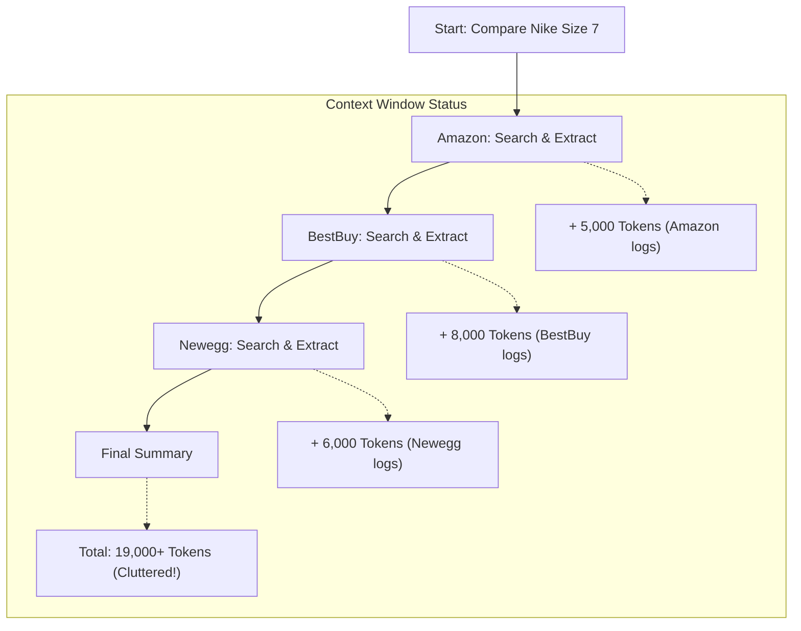
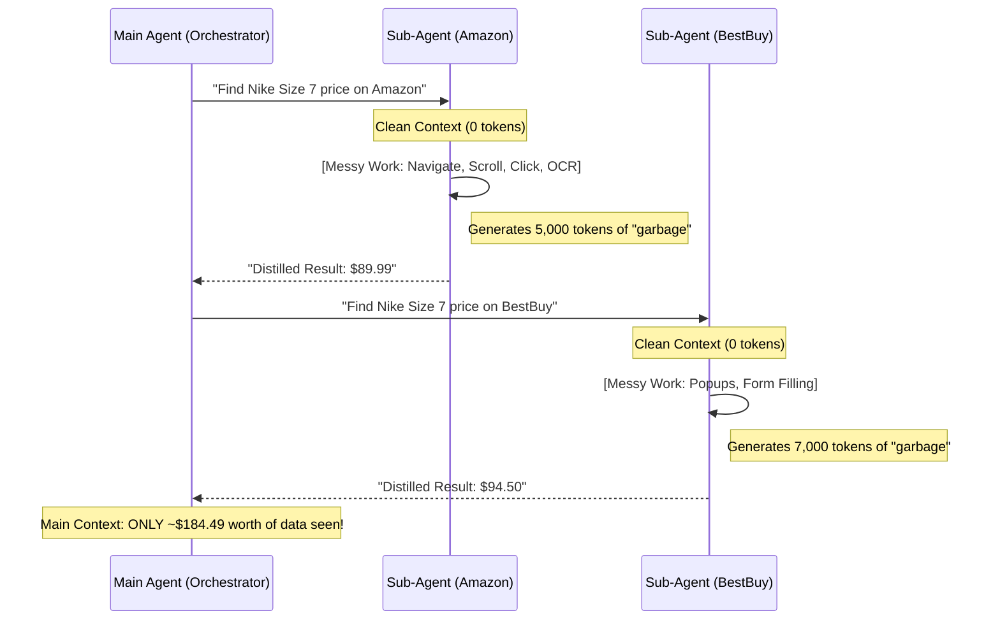
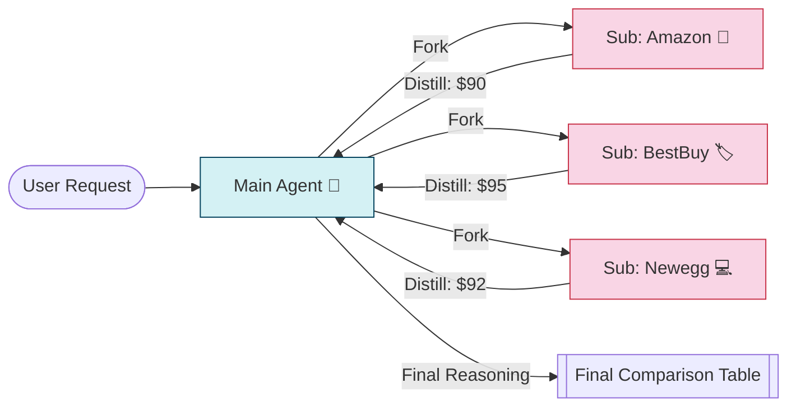

# Sub-Agent Context Management: Protecting the "Smart Zone"

This document explains how AI-Worker uses the **Sub-Agent (Fork and Distill)** pattern to handle complex tasks like product comparisons without overwhelming the main context window.

---

## 1. The Problem: Context Bloat (Traditional Approach)

Imagine a single agent trying to compare Nike shoes across Amazon, BestBuy, and Newegg.

**The "Dumb Zone" Trap:**
As the agent navigates each site, the context window fills with:
- HTML snapshots / Accessibility trees
- Error messages & retries
- Intermediate search results
- Page scrolling logs

By the time it gets to the 3rd website, the agent is "cluttered." It might forget the specific size (Size 7) or the price from the first site.

---

## 2. The Solution: AI-Worker's "Fork and Distill"

Instead of one agent doing everything, AI-Worker **forks** each search into a separate, isolated sub-agent.

### Step 1: Forking (Isolation)
The Main Agent spawns 3 sub-agents. Each sub-agent starts with a **clean, 0-token context**. All their messy "detecting buttons" and "scrolling" happens in their own isolated box.

### Step 2: Distillation (Compression)
Once a sub-agent finds the price, it returns **ONLY the final answer** (the "distillate") to the Main Agent.

---

## 3. Real Example: Nike Shoe Comparison

**User Request:** *"Search Nike shoes of size 7 and compare Amazon/BestBuy and get me the price?"*

### How Context is Saved:

| Activity | Sub-Agent (Messy Zone) | Main Agent (Smart Zone) |
|----------|------------------------|--------------------------|
| **Navigation** | 2,000 tokens of URL/redirect logs | **0 tokens** (Hidden) |
| **Search UI** | 3,000 tokens of accessibility nodes | **0 tokens** (Hidden) |
| **Selecting Size 7** | 1,500 tokens of click/retry logs | **0 tokens** (Hidden) |
| **Final Price** | **Result: $89.99** | **Seen: "Amazon: $89.99"** |

### The "Distillate" Format
The sub-agent is instructed to return *only* a structured summary.
**Sub-Agent Response:**
> "Found 'Nike Air Zoom' in Size 7 on Amazon. Price: $89.99. In stock: Yes. Shipping: $5.00."

**Total Context Cost for Main Agent:** ~50 tokens per website.
**Cost without Sub-Agents:** ~10,000+ tokens per website.

---

## 4. Why this keeps the AI "Smart"

1.  **Zero Trajectory Errors:** If a sub-agent gets a popup on Amazon and takes 5 steps to close it, those 5 "error correction" steps never enter the Main Agent's history. The Main Agent never "learns" those errors.
2.  **Parallel Search:** Because sub-agents are isolated, they can run at the same time. The Main Agent just waits for the "pings" of distilled data.
3.  **High Signal, No Noise:** The Main Agent's context window contains *only* the user request and the final answers. This allows it to perform **perfect reasoning** (e.g., "Amazon is $5 cheaper but BestBuy has free shipping").

---

## Summary Diagram

