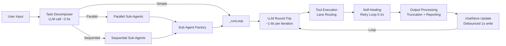

# AI-Worker: Performance Analysis & Optimization Plan

> **Goal**: Systematically profile, measure, and optimize the end-to-end latency and resource usage of the AI-Worker agent across all task execution paths — from user input to final response — with a focus on tool call pipelines, LLM round-trips, and concurrency bottlenecks.
>
> **Instrumentation Strategy**: Build the tracing layer as an **exportable npm library** (`@ai-worker/perf-tracer`) so that any AI agent app can plug in and track performance metrics using a standardized API.

---

## Table of Contents

1. [Existing Open-Source Ecosystem](#1-existing-open-source-ecosystem)
2. [Our Library Design: `@ai-worker/perf-tracer`](#2-our-library-design-ai-workerperf-tracer)
3. [Current Architecture Bottleneck Map](#3-current-architecture-bottleneck-map)
4. [Instrumentation Plan (Phase 1)](#4-instrumentation-plan-phase-1)
5. [Benchmark Suite (Phase 2)](#5-benchmark-suite-phase-2)
6. [Optimization Targets (Phase 3)](#6-optimization-targets-phase-3)
7. [Implementation Roadmap](#7-implementation-roadmap)

---

## 1. Existing Open-Source Ecosystem

Before building, here is what already exists and where each falls short for our use-case:

### Landscape Comparison

| Library | License | Self-Host | Agent-Aware | Tool-Call Tracing | Electron/Local Support | Our Verdict |
|---------|---------|-----------|-------------|-------------------|----------------------|-------------|
| **Langfuse** | MIT ✅ | Yes ✅ | Partial | Yes (via decorators) | ❌ Requires server | Best OSS platform, but cloud/server-dependent. No local-first mode. |
| **OpenLLMetry** (Traceloop) | Apache 2.0 ✅ | Yes ✅ | No | Yes (OTel spans) | ⚠️ Heavy dependency | OTel-native, great standard — but requires OTLP collector backend. |
| **AgentOps** | MIT ✅ | No ❌ | Yes ✅ | Yes ✅ | ❌ Cloud-only | Best agent lifecycle tracking, but proprietary backend required. |
| **Helicone** | Apache 2.0 ✅ | Limited | No | No | ❌ Proxy-based | Gateway model, not embeddable. Wrong architecture for desktop apps. |
| **Arize Phoenix** | BSL/Apache ✅ | Yes ✅ | Partial | Yes (OpenInference) | ❌ Python-first | Excellent visualizations, but Python ecosystem. No JS/TS SDK. |
| **LangSmith** | Proprietary ❌ | Enterprise only | Yes | Yes | ❌ Cloud-only | Best LangChain integration, but closed-source and cloud-only. |
| **Braintrust** | Proprietary ❌ | No ❌ | Partial | Yes | ❌ Cloud-only | Eval-focused, not observability-focused. |

### Gap Analysis: Why Build Our Own

None of the existing tools satisfy ALL of these requirements:

1. **Local-first / Offline**: AI-Worker is a desktop Electron app. Users may run Ollama locally with zero internet. The tracer must work 100% offline.
2. **Agent loop-aware**: Need first-class primitives for `agentLoop`, `llmCall`, `toolCall`, `selfHealingRetry`, `subAgentFork`, `laneQueue` — not just generic HTTP spans.
3. **Zero backend required**: No OTLP collector, no cloud dashboard. Traces stored locally, viewable in-app.
4. **Framework-agnostic**: Not tied to LangChain, LlamaIndex, or any specific LLM SDK. Works with raw `fetch()` calls to any provider.
5. **Exportable**: Other AI agent apps should be able to `npm install @ai-worker/perf-tracer` and use it standalone.

**Strategy**: Build a lightweight, OTel-compatible tracer that works locally and can optionally export to Langfuse/Jaeger/any OTLP backend.

---

## 2. Our Library Design: `@ai-worker/perf-tracer`

### 2.1 API Design (Public Surface)

```typescript
// @ai-worker/perf-tracer

// ── Core Types ─────────────────────────────────────────────────────────────────

export interface PerfSpan {
  spanId: string;
  parentSpanId?: string;
  name: string;
  kind: SpanKind;
  startMs: number;
  endMs?: number;
  durationMs?: number;
  status: 'ok' | 'error' | 'timeout' | 'aborted';
  attributes: Record<string, string | number | boolean>;
  children: PerfSpan[];
}

export type SpanKind =
  | 'agent_loop'        // Top-level agent execution
  | 'llm_call'          // LLM round-trip (any provider)
  | 'tool_call'         // MCP tool execution
  | 'tool_retry'        // Self-healing retry attempt
  | 'ipc_call'          // IPC bridge round-trip
  | 'sub_agent'         // Sub-agent fork
  | 'orchestration'     // Parallel/sequential orchestration
  | 'lane_queue'        // Lane queue wait
  | 'context_prune'     // Context pruning
  | 'storage_write'     // Persistence write
  | 'decomposition'     // Task decomposition
  | 'custom';           // User-defined

export interface PerfTrace {
  traceId: string;
  sessionId: string;
  taskType: 'direct' | 'parallel_fork' | 'sequential_fork' | 'sub_agent';
  rootSpan: PerfSpan;
  summary: TraceSummary;
  metadata: Record<string, unknown>;
}

export interface TraceSummary {
  totalDurationMs: number;
  llmRoundTrips: number;
  totalLlmMs: number;
  avgLlmMs: number;
  toolCalls: number;
  totalToolMs: number;
  avgToolMs: number;
  retryCount: number;
  ipcCalls: number;
  totalIpcMs: number;
  peakMemoryMB?: number;
  contextTokensEstimate?: number;
}

// ── Tracer API ─────────────────────────────────────────────────────────────────

export class PerfTracer {
  constructor(options?: TracerOptions);

  /** Start a new trace (one per agent task) */
  startTrace(traceId: string, metadata?: Record<string, unknown>): PerfTrace;

  /** Start a span within the current trace */
  startSpan(name: string, kind: SpanKind, attributes?: Record<string, unknown>): PerfSpan;

  /** End a span and compute duration */
  endSpan(spanId: string, status?: 'ok' | 'error' | 'timeout' | 'aborted'): void;

  /** Convenience: measure an async function as a span */
  measure<T>(name: string, kind: SpanKind, fn: () => Promise<T>): Promise<T>;

  /** End the trace and compute summary */
  endTrace(traceId: string): PerfTrace;

  /** Get the current active trace */
  getActiveTrace(): PerfTrace | null;

  /** Export all completed traces */
  getTraces(options?: { limit?: number; since?: number }): PerfTrace[];

  /** Subscribe to trace events (for live UI updates) */
  onSpanEnd(callback: (span: PerfSpan, trace: PerfTrace) => void): () => void;

  /** Clear all stored traces */
  clear(): void;
}

export interface TracerOptions {
  /** Max traces to keep in memory (default: 100) */
  maxTraces?: number;

  /** Enable console logging of spans (default: false) */
  debug?: boolean;

  /** Optional: export to OTLP-compatible backend */
  otlpEndpoint?: string;

  /** Optional: export to Langfuse */
  langfuseConfig?: { publicKey: string; secretKey: string; host?: string };

  /** Storage adapter for persistence (default: in-memory) */
  storage?: TracerStorage;
}

export interface TracerStorage {
  save(trace: PerfTrace): Promise<void>;
  load(traceId: string): Promise<PerfTrace | null>;
  list(options?: { limit?: number; since?: number }): Promise<PerfTrace[]>;
  clear(): Promise<void>;
}
```

### 2.2 Usage Example (Any AI Agent App)

```typescript
import { PerfTracer } from '@ai-worker/perf-tracer';

const tracer = new PerfTracer({ debug: true, maxTraces: 50 });

// Wrap your agent loop
async function runAgent(userInput: string) {
  const trace = tracer.startTrace(crypto.randomUUID(), { userInput });

  // Measure LLM call
  const llmResult = await tracer.measure('gemini-flash', 'llm_call', async () => {
    return await callLLM(userInput);
  });

  // Measure tool execution
  if (llmResult.toolCalls) {
    for (const tool of llmResult.toolCalls) {
      await tracer.measure(tool.name, 'tool_call', async () => {
        return await executeTool(tool);
      });
    }
  }

  const completedTrace = tracer.endTrace(trace.traceId);
  console.log(`Task completed in ${completedTrace.summary.totalDurationMs}ms`);
  console.log(`  LLM: ${completedTrace.summary.llmRoundTrips} calls, ${completedTrace.summary.avgLlmMs}ms avg`);
  console.log(`  Tools: ${completedTrace.summary.toolCalls} calls, ${completedTrace.summary.avgToolMs}ms avg`);
}
```

### 2.3 Package Structure

```
packages/perf-tracer/
├── package.json              # @ai-worker/perf-tracer
├── tsconfig.json
├── src/
│   ├── index.ts              # Public API exports
│   ├── tracer.ts             # PerfTracer class implementation
│   ├── span.ts               # Span lifecycle management
│   ├── trace.ts              # Trace aggregation + summary computation
│   ├── storage/
│   │   ├── memory.ts         # In-memory storage (default)
│   │   ├── indexeddb.ts      # Browser/Electron IndexedDB adapter
│   │   └── filesystem.ts     # Node.js file-based adapter
│   ├── exporters/
│   │   ├── otlp.ts           # OpenTelemetry Protocol exporter
│   │   ├── langfuse.ts       # Langfuse exporter
│   │   ├── json.ts           # JSON file exporter
│   │   └── console.ts        # Pretty-print console exporter
│   └── types.ts              # All public types
├── tests/
│   ├── tracer.test.ts
│   ├── span.test.ts
│   └── exporters.test.ts
└── README.md
```

### 2.4 Differentiators vs Existing Libraries

| Feature | `@ai-worker/perf-tracer` | Langfuse JS SDK | OpenLLMetry | AgentOps |
|---------|-------------------------|-----------------|-------------|----------|
| **Zero-dependency core** | ✅ | ❌ (fetch + retry) | ❌ (OTel SDK) | ❌ (cloud SDK) |
| **Works offline** | ✅ | ❌ | ❌ | ❌ |
| **Agent-loop span kind** | ✅ | ❌ | ❌ | ✅ |
| **Self-healing retry tracking** | ✅ | ❌ | ❌ | ❌ |
| **Lane/queue wait tracking** | ✅ | ❌ | ❌ | ❌ |
| **Sub-agent fork tracking** | ✅ | ❌ | ❌ | ✅ |
| **OTLP export (optional)** | ✅ | ❌ | ✅ | ✅ |
| **Langfuse export (optional)** | ✅ | N/A | ❌ | ❌ |
| **Browser + Node.js** | ✅ | ✅ | Node only | Node only |
| **< 5KB gzipped** | ✅ Target | ~15KB | ~50KB+ | ~20KB |

---

## 3. Current Architecture Bottleneck Map

Based on the codebase analysis, here is every performance-critical path in the system:



### Hot Path Timing Estimates (Current State)

| Stage | Typical Latency | Worst Case | Notes |
|-------|----------------|------------|-------|
| Task decomposition (`analyzeTaskWithLLM`) | 2-5s | 10s | Extra LLM call before any work begins |
| LLM round-trip (Gemini Flash) | 1-3s | 8s | Per iteration, 5-50 iterations per task |
| LLM round-trip (Ollama local) | 2-8s | 30s | Model loading adds cold-start penalty |
| IPC bridge (`mcp:call-tool`) | 1-5ms | 50ms | Fast, but serialization overhead adds up |
| Tool execution (browser click) | 100-500ms | 30s (timeout) | Lane timeout at 30s |
| Tool execution (navigate) | 1-5s | 120s (timeout) | Network-dependent |
| Tool execution (screenshot) | 200-800ms | 15s (timeout) | Rendering + encoding |
| Tool execution (fs read/write) | 5-50ms | 30s | Large files or slow disks |
| Tool execution (memory search) | 10-100ms | 500ms | In-process, scales with entity count |
| Tool execution (MarkItDown) | 500ms-5s | 30s | External process, file-dependent |
| Self-healing retry | +1-2s per attempt | +120s cumulative | Max 2 retries, cumulative 120s cap |
| Output truncation | <1ms | 5ms | String slice, negligible |
| Result reporting (`analyzeToolOutput`) | 1-5ms | 20ms | Regex-based pattern matching |
| `chatStore.setItem` | 5-50ms | 200ms | Debounced to 1/s, but stringify is O(n) |
| Context pruning (DCP) | 1-10ms | 100ms | Runs every iteration |
| `JSON.stringify(messages)` context check | 10-100ms | 500ms+ | Only every 10 iterations (resync) |

---

## 4. Instrumentation Plan (Phase 1)

> **Key Principle**: All instrumentation uses `@ai-worker/perf-tracer` so the library is dogfooded from day one.

### 4.1 Instrumentation Points

| Component | What to Measure | Span Kind | How |
|-----------|----------------|-----------|-----|
| `agent-runtime.ts` | Total task duration, iteration count, decomposition time | `agent_loop` | Wrap `chat()` and `_runLoop()` |
| `llm.ts` | Per-provider round-trip, token counts in/out, streaming latency | `llm_call` | Wrap `chat()` call in each provider |
| `ToolExecutionService.ts` | Per-tool execution time, retry count, error types | `tool_call`, `tool_retry` | Wrap `executeWithSelfHealing()` |
| `execution-lanes.ts` | Queue wait time, lane utilization, timeout frequency | `lane_queue` | Instrument `LaneQueue.run()` |
| `mcp.ts` | IPC serialization time, round-trip per tool call | `ipc_call` | Wrap `executeToolCall()` |
| `dcp.ts` | Pruning time, messages removed, context size before/after | `context_prune` | Wrap `pruneContext()` |
| `chatStore.ts` | Stringify time, storage write time, debounce effectiveness | `storage_write` | Instrument storage adapter |
| `task-decomposer.ts` | Analysis LLM call time, cache hit rate | `decomposition` | Wrap `analyzeTaskForDecomposition()` |
| `OrchestrationService.ts` | Sub-agent spawn time, parallel wait time, total overhead | `orchestration`, `sub_agent` | Wrap dispatchers |

### 4.2 Integration Pattern

```typescript
// In agent-runtime.ts
import { PerfTracer } from '@ai-worker/perf-tracer';

const tracer = new PerfTracer({ debug: process.env.NODE_ENV === 'development' });

// Inside _runLoop:
const llmResponse = await tracer.measure(
  `llm:${provider}:iteration-${iterationCount}`,
  'llm_call',
  async () => chat(this.messages, allTools, this.options.settings, ...)
);

const toolResult = await tracer.measure(
  `tool:${call.name}`,
  'tool_call',
  async () => executeWithSelfHealing(call.name, call.arguments, ...)
);
```

### 4.3 Dev-Only Performance Overlay

Build a `PerfPanel` component (`Ctrl+Shift+P` toggle):

- **Live counters**: Current iteration, tool calls executed, LLM tokens used
- **Flamechart**: Collapsible tree of spans for the active task
- **Histograms**: LLM latency distribution, tool latency distribution
- **Alerts**: Highlight any span > 10s in red
- **Export**: One-click JSON export of all traces for offline analysis

---

## 5. Benchmark Suite (Phase 2)

> Each benchmark represents a real-world user workflow. Run them on a standardized machine to establish baselines.

### 5.1 Benchmark Definitions

| ID | Name | Expected Path | Target | Measures |
|----|------|--------------|--------|----------|
| **B1** | Simple Question (No Tools) | User → LLM → Response | < 3s | LLM cold-start, serialization |
| **B2** | Single Tool Call (File Read) | User → LLM → `fs_read_file` → LLM → Response | < 5s | IPC round-trip, 2x LLM calls |
| **B3** | Browser Research (5-8 tools) | User → LLM → navigate → get_state → click → ... → Response | < 30s | Browser lane serialization, self-healing |
| **B4** | File Attachment (PDF) | Attach 10-page PDF + summarize | < 15s | MarkItDown subprocess, truncation |
| **B5** | Parallel Sub-Agent Fork | Compare prices on 2 sites simultaneously | < 60s | Decomposition, parallel browser tabs |
| **B6** | Sequential Sub-Agent Fork | Research → table → save file | < 90s | Plan creation, step handoffs |
| **B7** | WhatsApp-Triggered Task | WA message → research → reply | < 15s | Bridge latency, dedup, WA send |
| **B8** | Long-Running (50 iterations) | Deep analysis of 20 items | Track growth | Context resync, memory leaks |
| **B9** | Concurrent Multi-Session | B3 + B2 in parallel sessions | < 1.5× solo | Session isolation, lane contention |
| **B10** | MCP Server Cold Connect | Fresh start → 4 servers connected | < 10s | Process spawn, schema fetch |

### 5.2 Benchmark Harness

```typescript
// src/renderer/src/lib/__benchmarks__/runner.ts
interface BenchmarkResult {
  id: string;
  name: string;
  runs: number;
  avgMs: number;
  p50Ms: number;
  p95Ms: number;
  p99Ms: number;
  trace: PerfTrace;   // Full trace from @ai-worker/perf-tracer
  metrics: {
    llmCalls: number;
    toolCalls: number;
    totalTokensIn: number;
    totalTokensOut: number;
    retries: number;
    peakMemoryMB: number;
  };
}
```

---

## 6. Optimization Targets (Phase 3)

### 6.1 LLM Round-Trip Reduction

> Each LLM round-trip is 1-8s. Reducing the number of iterations is the single highest-impact optimization.

| Optimization | Impact | Effort | Description |
|---|---|---|---|
| **Parallel tool dispatch** | 🟢 High | Medium | LLM often returns tools one at a time. Encourage batch tool calls in system prompt. |
| **Speculative tool pre-loading** | 🟡 Medium | Medium | Pre-warm browser page if LLM mentions navigation intent. |
| **Response caching for decomposition** | 🟡 Medium | Low | Cache `analyzeTaskForDecomposition` result beyond 5m TTL. Cache tool schemas. |
| **Skip decomposition for short prompts** | 🟢 High | ✅ Done | `TRIVIAL_PROMPT_LENGTH = 20` guard already implemented. |
| **Streaming tool results** | 🟡 Medium | High | Stream partial tool output to LLM (requires provider support). |

### 6.2 Tool Execution Pipeline

| Optimization | Impact | Effort | Description |
|---|---|---|---|
| **Browser warm pool** | 🟢 High | Medium | Pre-launch browser on first chat. Current idle timeout (5min) is good, but cold JIT adds 2-4s. |
| **Screenshot compression** | 🟡 Medium | Low | Downscale to 1280px, JPEG@60% quality for tool output. |
| **Lane timeout tuning** | 🟡 Medium | Low | Profile real-world p95 and tighten generous timeouts. |
| **MarkItDown connection pooling** | 🟡 Medium | Medium | Keep process warm between calls instead of relying on auto-connect. |
| **IPC batch operations** | 🟡 Medium | High | Batch multiple quick tool calls into a single IPC round-trip. |
| **Tool output streaming** | 🟡 Medium | High | Stream chunks for large results instead of waiting for full output. |

### 6.3 Context Management

| Optimization | Impact | Effort | Description |
|---|---|---|---|
| **Incremental context size tracking** | 🟢 High | ✅ Done | `_estimatedContextBytes` avoids `JSON.stringify` on every iteration. |
| **Smarter DCP pruning** | 🟡 Medium | Medium | Token-aware pruning: remove oldest tool results first, keep user messages. |
| **Tool output dedup** | 🟡 Medium | Low | Replace identical repeated tool outputs with "Same as above." |
| **Context compression** | 🔴 Low | High | Summarization pass for older history. High effort, moderate gain. |

### 6.4 State Management & Storage

| Optimization | Impact | Effort | Description |
|---|---|---|---|
| **Debounced storage** | 🟢 High | ✅ Done | 1s debounce on `chatStore` already implemented. |
| **Selective persistence** | 🟡 Medium | Medium | Only write active session's delta, not all sessions. |
| **IndexedDB migration** | 🟡 Medium | High | Move from `localStorage` (sync, 5MB limit) to IndexedDB (async, no limit). |
| **Tool call result trimming** | 🟡 Medium | Low | Strip large tool `result` fields to 500 chars before persist. |

### 6.5 Concurrency & Resource Management

| Optimization | Impact | Effort | Description |
|---|---|---|---|
| **Sub-agent limit** | 🟢 High | Low | Cap parallel sub-agents at 3 (currently unlimited). |
| **Browser memory cap** | 🟡 Medium | Medium | Monitor Chromium RSS, force GC or close idle tabs if > 500MB. |
| **Lane queue telemetry** | 🟡 Medium | Low | Warn when tool call waits > 5s in queue (lane contention). |
| **Abort signal propagation** | 🟡 Medium | Low | Ensure abort propagates through all layers to avoid orphaned processes. |

### 6.6 Startup Performance

| Optimization | Impact | Effort | Description |
|---|---|---|---|
| **Lazy tool schema loading** | 🟢 High | ✅ Done | Cached tool schemas avoid reconnecting on startup. |
| **Deferred MarkItDown connect** | 🟡 Medium | Low | Don't auto-connect until first file attachment. Saves ~2s. |
| **Parallel server connection** | 🟡 Medium | Low | Connect external servers in parallel (internal ones are instant). |
| **Code splitting for agent runtime** | 🟡 Medium | Medium | Lazy-load `agent-runtime.ts`, `task-decomposer.ts`, `OrchestrationService.ts` on first chat. |

---

## 7. Implementation Roadmap

### Phase 1: Build `@ai-worker/perf-tracer` Library (Week 1-2)
- [ ] Scaffold `packages/perf-tracer/` with TypeScript, build config, tests
- [ ] Implement core `PerfTracer` class with span stack management
- [ ] Implement `TraceSummary` auto-computation on `endTrace()`
- [ ] Build `MemoryStorage` adapter (default)
- [ ] Build `ConsoleExporter` for dev debugging
- [ ] Build `JSONExporter` for file-based trace dumps
- [ ] Write unit tests for tracer lifecycle, nested spans, concurrent traces
- [ ] Publish to npm as `@ai-worker/perf-tracer` (or scoped private registry)

### Phase 2: Integrate & Instrument (Week 2-3)
- [ ] Instrument `AgentRuntime.chat()`, `_runLoop()`, `_emitProgress()` with `agent_loop` spans
- [ ] Instrument `executeWithSelfHealing()` with `tool_call` and `tool_retry` spans
- [ ] Instrument `LaneQueue.run()` with `lane_queue` spans (queue-wait + execution)
- [ ] Instrument `chat()` in `llm.ts` with `llm_call` spans (per-provider latency)
- [ ] Instrument `executeToolCall()` in `mcp.ts` with `ipc_call` spans
- [ ] Instrument storage adapter with `storage_write` spans
- [ ] Build `PerfPanel` dev overlay component (`Ctrl+Shift+P`)

### Phase 3: Baseline Benchmarks (Week 3-4)
- [ ] Implement benchmark harness with automated result collection
- [ ] Run B1-B10 on 3 LLM providers (Gemini Flash, Ollama qwen2.5, GPT-4o-mini)
- [ ] Establish p50/p95/p99 baselines for each benchmark
- [ ] Profile memory usage over B8 (long-running task)
- [ ] Profile concurrent-session overhead (B9)
- [ ] Document baseline results in `PERFORMANCE-BASELINE.md`

### Phase 4: Quick Wins (Week 4-5)
- [ ] Tune lane timeouts based on p95 real-world data
- [ ] Screenshot compression (JPEG@60%, max 1280px)
- [ ] Tool output dedup for repeated identical results
- [ ] Trim tool call results before persist (500 char cap)
- [ ] Cap parallel sub-agents at 3
- [ ] Lane queue wait telemetry (warn on > 5s)
- [ ] Parallel MCP server connection on startup

### Phase 5: Structural Optimizations (Week 6-10)
- [ ] Browser warm pool with pre-launch strategy
- [ ] Token-aware DCP pruning with priority queuing
- [ ] Selective session persistence (delta writes)
- [ ] Code splitting for agent runtime (dynamic imports)
- [ ] Deferred MarkItDown connection
- [ ] Sub-agent memory monitoring and auto-cleanup
- [ ] Optional OTLP exporter for teams using Langfuse/Jaeger
- [ ] IndexedDB migration for chat history (long-term)

### Phase 6: Continuous Monitoring (Ongoing)
- [ ] Automated regression benchmarks in CI (B1-B4 as fast tests)
- [ ] Performance budget alerts (e.g., B1 > 5s = regression)
- [ ] Monthly benchmark report comparing against Phase 3 baseline

---

> **Priority Order**: 🟢 High-impact items first. ✅ Done items should be validated, not reimplemented.
> Phase 1 (the npm library) is the foundation — everything else depends on it.

---

**Created**: 2026-04-02  
**Scope**: AI-Worker v0.2.1  
**Files Analyzed**: `agent-runtime.ts`, `ToolExecutionService.ts`, `execution-lanes.ts`, `OrchestrationService.ts`, `chatStore.ts`, `mcpStore.ts`, `mcp.ts`, `dcp.ts`, `task-decomposer.ts`, `llm.ts`
